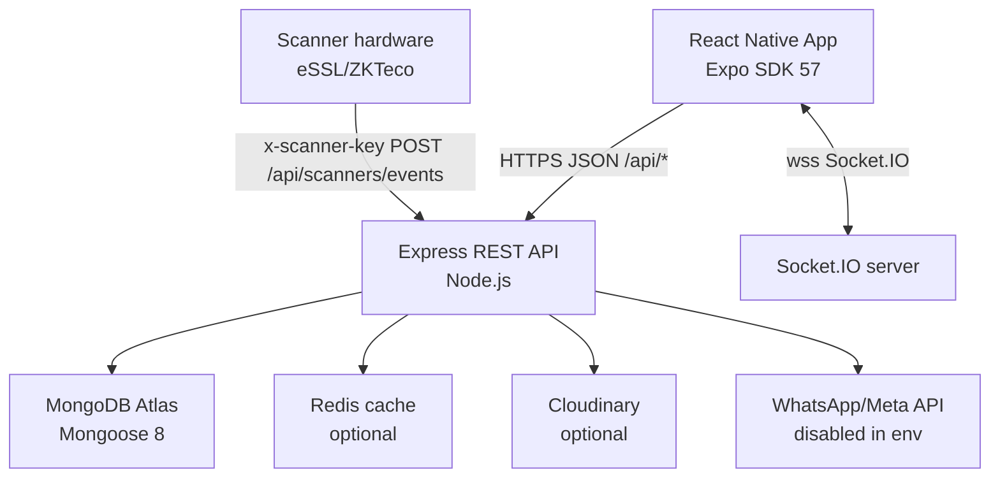
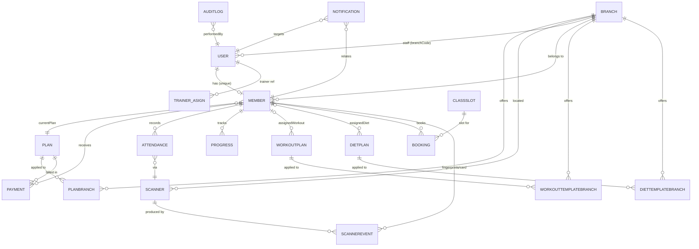
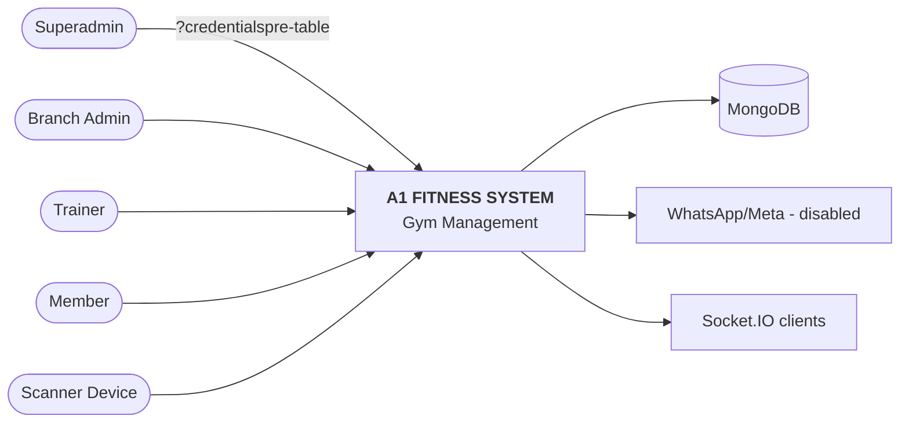
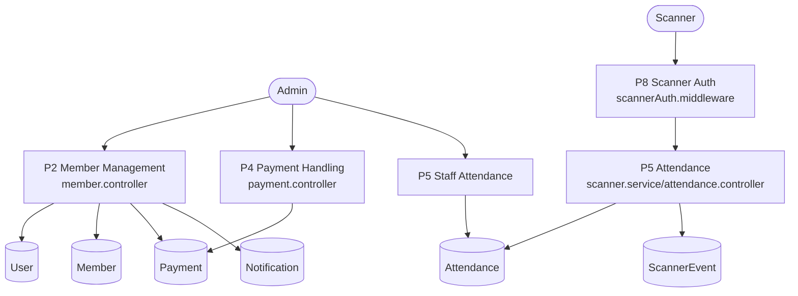
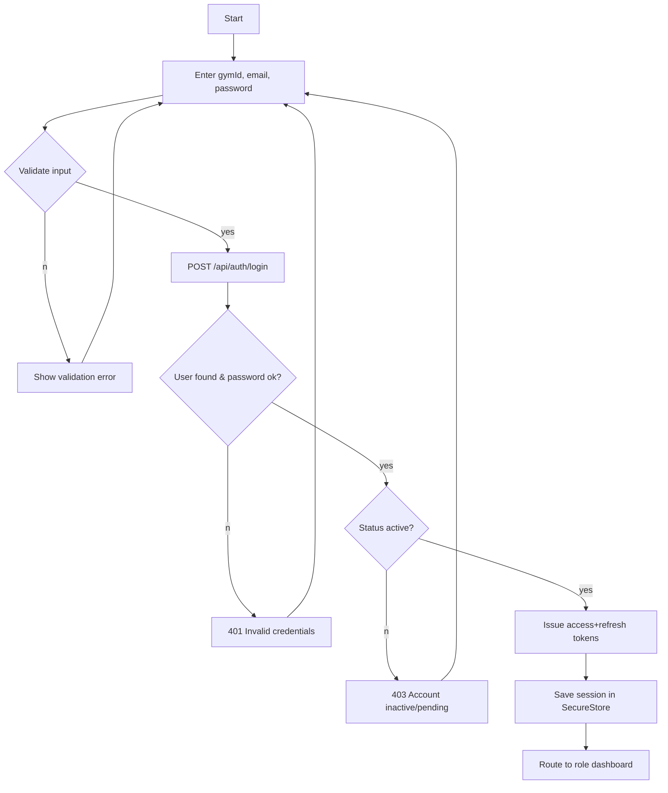
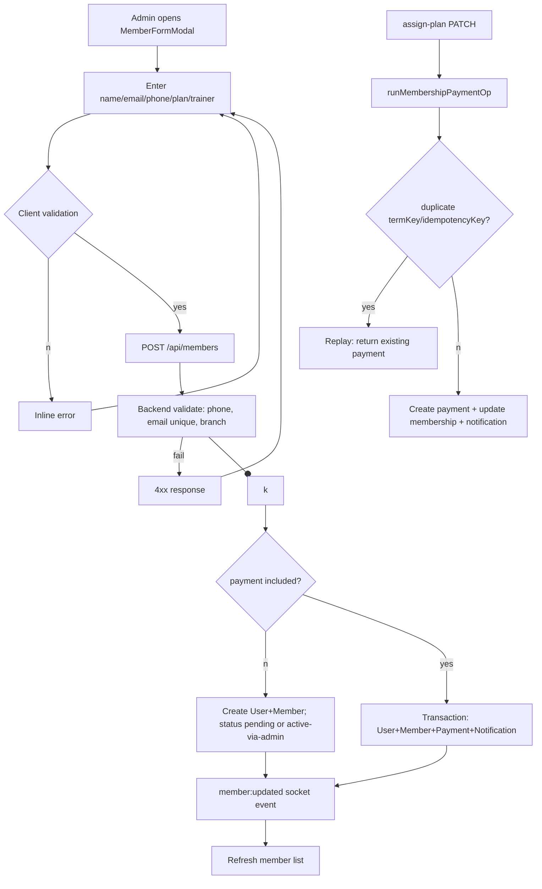
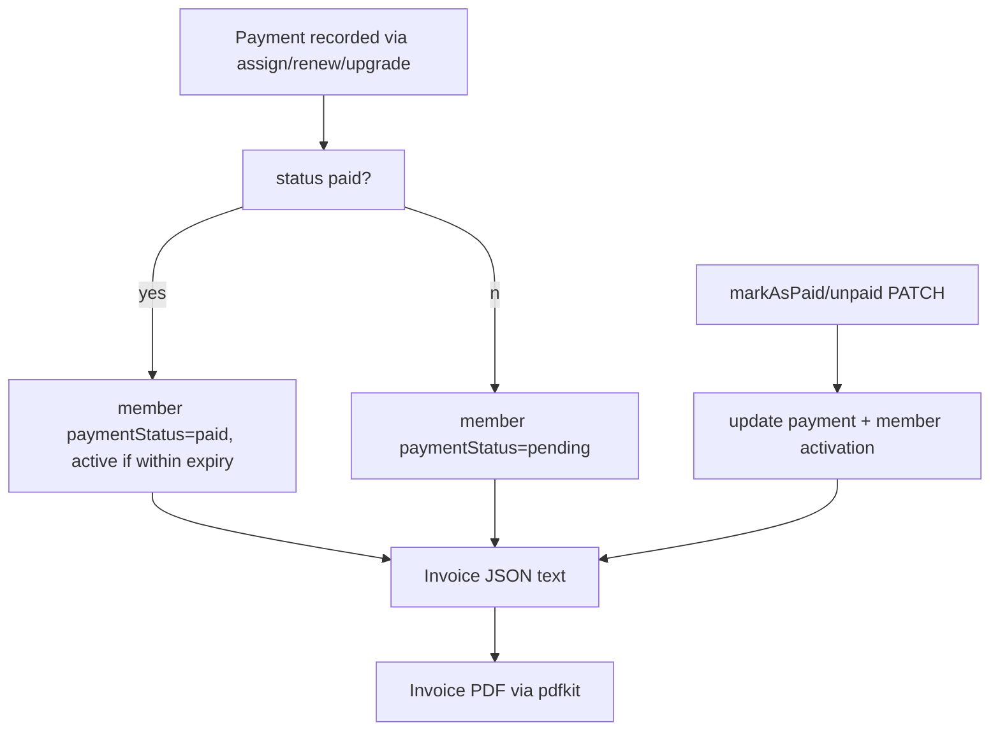
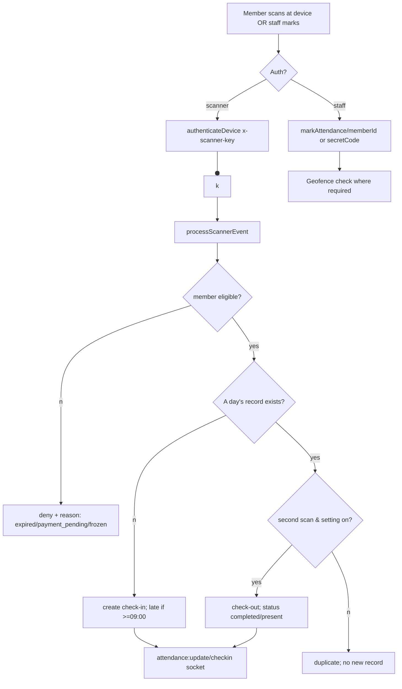
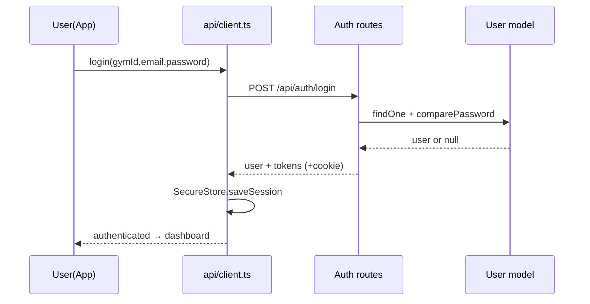
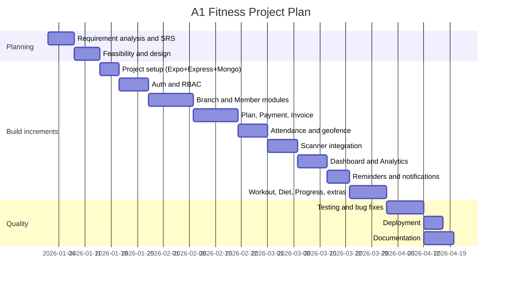

# A1 FITNESS — COMPLETE PROJECT REPORT REQUIREMENTS

**Investigation source:** actual A1 Fitness codebase (repo root `A1FitnessApp/`)
**Date of investigation:** Sat Sep 12 2026
**Purpose:** verified data-collection document from which the final academic B.Tech IT project report is written. Nothing here should be pasted verbatim as "final report" — every claim is verified (V), partial (P), prototype (U), planned (PD), or requires owner confirmation (C) in Part L.

> NOTE: The "Urban Rose — Beauty Parlour Management System" sample report file is **NOT present anywhere in this repository or workspace**. Only its section list (25 headings) was supplied in the task prompt. Section-by-section analysis below is therefore based on (a) the 25 sample headings given in the brief and (b) the existing in-repo `PROJECT_REPORT.md` (a 1,401-line A1 Fitness draft that follows a *different* chapter scheme). The final report must be restructured to match the 25-section Urban Rose scheme.

---

## PART A — SAMPLE REPORT ANALYSIS

### A1. Complete sample report structure (as per the supplied brief)

| No. | Section | Typical content purpose |
| --- | --- | --- |
| 1 | Cover Page / Title Page | Project title, student name, enrollment, guide, college, year |
| 2 | Self Certificate / Declaration | Certificate signed by guide + HOD; student declaration of originality |
| 3 | Acknowledgement | Thanks to guide, HOD, principal, college, family |
| 4 | Table of Contents | Chapter + section listing |
| 5 | Introduction | Background, problem statement, project overview |
| 6 | Objective of the Project | Aim and measurable objectives |
| 7 | Software Requirement Specification (SRS) | Functional + non-functional requirements |
| 8 | Software Development Tools / Software Tools Used | IDE, languages, frameworks, libraries, DB tools |
| 9 | Hardware Requirements | Minimum/recommended hardware for dev and runtime |
| 10 | Software Requirements | OS, runtime, browser/device requirements |
| 11 | SDLC (Software Development Life Cycle) | Generic SDLC phases explanation |
| 12 | Selected SDLC Model and Justification | Which model + why |
| 13 | Software Project Planning | Scope, modules, phases, schedule, resources |
| 14 | System Design | Architecture, module design, DB design, screen design |
| 15 | Gantt Chart | Task schedule timeline |
| 16 | PERT Chart | Task network, dependencies, critical path |
| 17 | Flow Chart | Process flow of key workflows |
| 18 | ERD (Entity Relationship Diagram) | Entities, attributes, relationships |
| 19 | DFD (Data Flow Diagram) | Context/level-0/level-1 data flows |
| 20 | Screenshots Followed by Corresponding Code | Each UI screenshot + the code that produces it |
| 21 | Software Testing Techniques | Test types, cases, results |
| 22 | Software Maintenance | Types of maintenance, environment upkeep |
| 23 | Future Scope of the Project | Extensions and enhancements |
| 24 | Conclusion | Summary of outcomes |
| 25 | Bibliography / References | Books, docs, URLs |

### A2. Section-by-section requirements for A1 Fitness

**1. Cover Page / Title Page**
- *Sample provides:* Student/guide/college identity blocks.
- *A1 needs:* Same blocks.
- *From codebase:* Project title "A1 Fitness — Gym Management System" (PROJECT_REPORT.md:11).
- *Owner must supply:* Student name, enrollment, degree name, dept, college, address, guide name/designation, academic year (Part M).
- *Evidence:* PROJECT_REPORT.md:1–27 (template placeholders).

**2. Self Certificate / Declaration**
- *Sample provides:* Guide + HOD certificate text and originality declaration.
- *A1 needs:* Same; replace `[YOUR ...]` placeholders. Owner supplies names/signatures/dates (Part M).
- *Evidence:* PROJECT_REPORT.md:31–46.

**3. Acknowledgement**
- *Sample provides:* Standard gratitude paragraphs.
- *A1 needs:* Same text adapted; owner adds real names. Evidence: PROJECT_REPORT.md:49–62.

**4. Table of Contents**
- *Sample provides:* Chapter tree.
- *A1 needs:* Regenerate to match the 25-section Urban Rose structure. Existing draft ToC (PROJECT_REPORT.md:94–107) uses the old 12-chapter scheme — must be replaced.

**5. Introduction**
- *Sample provides:* Background of the domain + what the project is.
- *A1 needs:* Fitness-industry background, manual-management pain points, description of A1 Fitness. See Part B (fully supplied, codebase-verified).

**6. Objective of the Project**
- *Sample provides:* A numbered aims list.
- *A1 needs:* The objectives in Part B.4, each tied to an implemented module.

**7. SRS**
- *Sample provides:* Functional + non-functional requirements.
- *A1 needs:* Part E (complete FR/NFR set with IDs, roles, evidence file paths).

**8. Software Development Tools / Software Tools Used**
- *Sample provides:* A tools table.
- *A1 needs:* Part C.9 dependencies + DevTools list (Node 18+/22, npm, Expo CLI, VS Code, MongoDB Compass, Postman usage — postman usage is *assumed*, see Part M).

**9. Hardware Requirements**
- *Sample provides:* Dev-machine and production specs.
- *A1 needs:* Part E.3 table (dev machine, Android device, deployment services). Some rows need confirmation (Part M).

**10. Software Requirements**
- *Sample provides:* OS/toolchain table.
- *A1 needs:* Part E.4 table (Node, MongoDB, Redis, Expo SDK 57, Android 6.0+/iOS 12+ etc. — deployment versions need confirmation).

**11. SDLC**
- *Sample provides:* Generic explanation of the life cycle.
- *A1 needs:* Generic SDLC phases text + Part G (A1-specific).

**12. Selected SDLC Model and Justification**
- *Sample provides:* Model choice + rationale.
- *A1 needs:* Part G recommendation (**Iterative prototyping / agile-style incremental**) with honest caveat that this is a *recommended academic representation*, not a verified historical record.

**13. Software Project Planning**
- *Sample provides:* Scope, phases, resources, schedule.
- *A1 needs:* Part G (project planning table, milestones, risks). Dates → Part M.

**14. System Design**
- *Sample provides:* Architecture, module design, DB design, UI design.
- *A1 needs:* Part F (architecture, module breakdown, database, ERD, DFD, use cases, flowcharts, activity/sequence diagrams).

**15. Gantt Chart**
- *Sample provides:* Task bars over time.
- *A1 needs:* Part G "Gantt chart data" (tasks/dependencies/durations; dates are estimates to be confirmed).

**16. PERT Chart**
- *Sample provides:* Network diagram.
- *A1 needs:* Part G "PERT chart data" (task network + critical path; time estimates are representative — label as estimates).

**17. Flow Chart**
- *Sample provides:* Process flowcharts.
- *A1 needs:* Part F flowcharts (login, member registration, plan assignment, payment, attendance, scanner event, admin operations).

**18. ERD**
- *Sample provides:* Entity-relationship diagram.
- *A1 needs:* Part F ERD (User, Member, Plan, Payment, Attendance, Branch, Scanner, etc.) — Mermaid code provided.

**19. DFD**
- *Sample provides:* Context + level-1 diagrams.
- *A1 needs:* Part F DFD (external entities: Superadmin, Admin, Trainer, Member, Scanner device).

**20. Screenshots Followed by Corresponding Code**
- *Sample provides:* One screenshot + code snippet per screen.
- *A1 needs:* Part I list. **Screenshots do not exist in the repo** → owner must capture them (emulator/device + server running). Code snippets are extracted from actual files.

**21. Software Testing Techniques**
- *Sample provides:* Test techniques + sample cases.
- *A1 needs:* Part H (actual automated tests + proposed manual test plan). Do NOT reuse the 44/44 "100%" table from the old draft unless re-verified — the actual suite is ~55 cases / ~150 assertions across 6 files (Part H).

**22. Software Maintenance**
- *Sample provides:* Maintenance types.
- *A1 needs:* Part H "Maintenance" subsection.

**23. Future Scope**
- *Sample provides:* Enhancement list.
- *A1 needs:* Part J (future scope). Item statuses verified in code.

**24. Conclusion**
- *Sample provides:* Outcome summary.
- *A1 needs:* Part J (conclusion notes).

**25. Bibliography / References**
- *Sample provides:* Reference list.
- *A1 needs:* Part K (verified references = technologies actually present; pending ones to be confirmed by owner).

### A3. Required diagrams (final report)

| Diagram | Source data | Mermaid code provided? |
| --- | --- | --- |
| System architecture diagram | Part F.1 | yes |
| ERD | Part F.3 | yes |
| DFD level 0 (context) | Part F.4 | yes |
| DFD level 1 | Part F.4 | yes |
| Use case diagram | Part F.5 | yes |
| Flowcharts (login, registration, plan assign, payment, attendance, scanner) | Part F.6 | yes |
| Activity diagrams (major modules) | Part F.7 | yes |
| Sequence diagrams (login, member create, payment, attendance) | Part F.8 | yes |
| Gantt chart | Part G | yes (Mermaid gantt) |
| PERT chart | Part G | yes (Mermaid network-style) |

### A4. Required screenshots (final report)

See Part I for the complete ordered list (login, superadmin dashboard, members, plans, payments, attendance, branches, admins, scanners, admin dashboard, etc.). **All screenshots are missing** — owner must capture. Figure numbers and captions suggested in Part I.

### A5. Required academic information

Owner-supplied only (no codebase evidence): student name/enrollment, degree, department, college, university, address, guide, HOD, principal names, academic session, submission date, certificates/signatures, team composition, whether solo or team project, hours/dates of development. Full checklist in Part M.

## PART B — PROJECT OVERVIEW

### B1. Project name
**A1 Fitness — Gym Management System** (package `a1fitnessapp`, backend `gymza-server`). Source: package.json:2, server/package.json:2.

### B2. Project purpose
A full-stack gym membership-management system for **multi-branch** fitness centers. It centralizes member registration, subscription assignment/renewal/upgrade/freeze/cancel, payment tracking with invoices, daily attendance, branch management, dashboards/analytics, hardware-attendance-scanner registration, and membership-expiry reminders. Verified: PROJECT_REPORT.md:65–90 (draft), backend controllers (server/controllers/*.js), frontend screens (src/screens/*.tsx).

### B3. Problem statement
Gym operators manage members, plans, payments, and attendance manually (paper/spreadsheet) or with single-branch tools. Problems the codebase actually addresses:
1. **Manual record keeping** — no central member database (solution: Member + User models, CRUD).
2. **Multi-branch coordination** — multiple locations with inconsistent records (solution: Branch + `branchCode` on every record + branch-scoping middleware).
3. **Payment tracking** — dues, invoices, receipts hard to track (solution: Payment model, idempotency, invoice JSON + PDF).
4. **Subscription lifecycle complexity** — assign/renew/upgrade/freeze/resume/cancel handled inconsistently (solution: member.controller.js membership operations, transactional + idempotent).
5. **Attendance monitoring** — manual, no analytics (solution: Attendance model, check-in/out, streaks, geofence, scanner ingestion).
6. **Visibility/reporting** — no business KPIs (solution: dashboard + analytics controllers with CSV/PDF export).
7. **Expiring memberships unnoticed** — revenue leakage (solution: expiry cron job + reminder service, WhatsApp + in-app).

### B4. Objectives (each linked to implementation)
| # | Objective | Implementation | Module |
| --- | --- | --- | --- |
| O1 | Authenticate users securely and enforce role-based access | JWT access+refresh rotation, bcrypt, RBAC middleware | Auth (V) |
| O2 | Manage multiple gym branches with data isolation | Branch model + branchScope middleware | Branch (V) |
| O3 | Manage member lifecycle from signup to cancellation | Member CRUD, approve, deactivate | Member (V) |
| O4 | Manage subscription plans and branch-specific availability | Plan + PlanBranch junction | Plan (V) |
| O5 | Track payments, generate invoices, prevent duplicates | Payment + idempotency (termKey/idempotencyKey), PDF invoices | Payment (V) |
| O6 | Record daily attendance incl. scanner hardware events | Attendance model + scanner event pipeline | Attendance / Scanner (V) |
| O7 | Provide dashboards and analytics | Dashboard + Analytics controllers cached in Redis | Analytics (V) |
| O8 | Notify about expiry / pending payments | Notification model, cron job, WhatsApp service (config-gated) | Reminders (P — WhatsApp disabled in .env) |
| O9 | Manage trainers/workout/diet assignment | Trainer, Workout, Diet controllers + branch junction tables | Trainer/Workout/Diet (V backend, no frontend) |
| O10 | Track member fitness progress | Progress model (BMI calc) | Progress (V backend, no frontend) |
| O11 | Referral + class booking support | Referral/Booking/generic-entity controllers | Referral/Booking (V backend primarily) |

### B5. Scope
**In scope (implemented):** authentication (superadmin+admin used by app; trainer/member roles exist in backend), branch management, member management, plan management, payment + invoice, attendance, dashboards/analytics, scanner device registration + event ingestion, notifications/reminders, workout/diet/progress/booking/referral APIs, audit logging, export (CSV/PDF).
**Backend-only (no mobile UI):** trainer dashboard, member dashboard, workout/diet assignment UI, progress UI, booking UI, referral UI, notifications UI.
**Not found / not implemented:** web frontend source in this repo (only served static `client/dist` referenced in server.js:301–325; the `client/` source tree is absent), member-facing app, real payment gateway (always 501), real WhatsApp delivery (disabled in .env, service built and unit-tested), face recognition (placeholder only), geofenced self check-in partially implemented.

### B6. Target users
- **Superadmin** — owns all branches, admins, plans; sees all data. (Frontend implemented)
- **Branch Admin** — operates a single branch: members, plans display, payments, attendance, scanners. (Frontend implemented)
- **Trainer** — role exists end-to-end in backend (assigned members, workout/diet, attendance, payments view), **no trainer UI in the mobile app**.
- **Member** — self check-in/out, own attendance/PAYMENTS/profile in backend; member API endpoints exist; **no member UI in the mobile app** (auth.controller signup exists; app login is admin/superadmin only).
- **Scanner hardware device** — posts events/heartbeat via device-key auth (no human UI).

### B7. Application type
- **Client:** cross-platform mobile app — **React Native 0.86.3 via Expo SDK 57** (TypeScript). Not a web site; web target is configured in package.json ("web": "expo start --web") but no web UI source exists here.
- **Server:** REST API (Express.js) over HTTP/JSON, Socket.IO for realtime events.
- **Database:** MongoDB (Mongoose ODM), optional Redis cache.
- **Deployment targets in evidence:** Render (backend CORS/prod path + `.env.local` points at `https://a1-fitness.onrender.com/api`), Vercel origin allowed in CORS (server.js:37), Expo EAS (`eas.json`, projectId in app.json:29–31).

## PART C — CODEBASE ANALYSIS

### C1. Project structure (actual, excluding node_modules/dist/.expo)
```
A1FitnessApp/
├── App.tsx                      # App root: SafeAreaProvider > AuthProvider > RootNavigator
├── index.ts                     # Expo registerRootComponent
├── app.json                     # Expo app config (dark UI, android package, EAS project id)
├── eas.json                     # EAS build profiles (development/preview/production)
├── tsconfig.json                # extends expo/tsconfig.base, strict: true
├── package.json                 # RN app deps + scripts (typecheck, test)
├── .env.local                   # EXPO_PUBLIC_API_URL (Render production URL)
├── AGENTS.md / CLAUDE.md        # agent instructions (Expo SDK 57 note)
├── PROJECT_REPORT.md            # existing 1,401-line draft report (old 12-chapter scheme)
├── LICENSE                      # MIT (Expo template)
├── assets/                      # app icons/splash
├── tests/
│   └── idempotency.test.mjs     # UUID v4 unit tests (node:test)
├── src/
│   ├── api/                     # auth, members, plans, payments, attendance, dashboard,
│   │                            # admins, branches, scanners, client (fetch), idempotency
│   ├── auth/                    # AuthContext.tsx, session.ts (SecureStore), types.ts
│   ├── components/              # StatusBadge, SuperadminHeader, drawer/ (custom, no lib),
│   │                            # member/ (MemberFormModal, MemberSubscriptionModal)
│   ├── config/api.ts            # API base URL resolution
│   ├── mocks/                   # ScannerProvider + scannerData (mock scanner prototype)
│   ├── navigation/              # Role-based stack navigator + param types
│   ├── screens/                 # 25 screens (see Part D)
│   └── theme/colors.ts          # dark palette
└── server/                      # Node/Express backend
    ├── server.js                # app bootstrap, CORS, rate-limit, Socket.IO, mount 19 routers
    ├── package.json             # gymza-server
    ├── .env                     # 28 env vars (see C9; secrets not reported)
    ├── config/                  # db.js, redis.js, cloudinary.js, logger.js
    ├── models/                  # 17 files → 20 Mongoose models
    ├── routes/                  # 19 route modules
    ├── controllers/             # 21 controllers
    ├── middlewares/             # auth, scannerAuth, branchScope, error, validate
    ├── services/                # whatsapp, reminder, scanner, invoiceDelivery(402),
    │                            # paymentStatus, branchRename, templateBranch,
    │                            # cache, storage, userIndex
    ├── validations/             # auth.validation.js, user.validation.js (zod)
    ├── utils/                   # appError, asyncHandler, date, deviceKey, membership,
    │                            # pagination, response, tokens, upload, whatsappDebug
    ├── jobs/expiryReminder.job.js   # hourly cron
    ├── seeds/                   # seed.js, seedLogic.js (dev superadmin/trainer/member)
    ├── scripts/                 # migrations & repair scripts
    └── test/                    # 5 node:test suites
```

### C2. Frontend (React Native / Expo)
- **Framework:** React Native `0.86.3`, React `19.2.3`, Expo `~57.0.21` (package.json:8–12)
- **Language:** TypeScript `~6.0.3`, `strict: true` (tsconfig.json)
- **Build/run:** Expo CLI (`expo start`), MDX-free; scripts `start|android|ios|web|typecheck|test` (package.json:21–26)
- **Navigation:** `@react-navigation/native ^7.3.18`, `@react-navigation/native-stack ^7.18.10`; **custom** drawer components (`src/components/drawer/`), no drawer library
- **UI library:** none beyond RN core + `react-native-safe-area-context ~5.7.0`, `react-native-screens ~4.26.0`; **no react-native-paper** (old draft mentions it — incorrect vs. package.json)
- **State:** React Context — `AuthProvider`, `DrawerContext`, `ScannerProvider` (mock)
- **Persistent store:** `expo-secure-store ~57.0.3` (session)
- **HTTP:** custom `fetch`-based client `src/api/client.ts` (JWT attach, refresh-on-401, queueing). **No axios** (old draft's axios snippet is inaccurate)
- **Charts:** none — revenue bars are hand-built Views (`AdminDashboardScreen`/`SuperadminDashboardScreen`)
- **Icons:** text-glyphs/emoji glyphs (`☰`, `‹`, `₹`); no icon lib
- **Theme:** dark palette (src/theme/colors.ts)
- **Forms/validation:** inline regex (`EMAIL_REGEX`) + server validation; no form lib
- **API modules:** auth, members, plans, payments, attendance, dashboard, branches, admins, scanners, idempotency (src/api/*.ts)

### C3. Backend (Node.js / Express)
- **Runtime:** Node.js (versions not pinned; `@types/node ^25.5.0` dev-dep implies modern Node — owner confirm production version)
- **Framework:** Express `^4.22.1`; http server; Socket.IO `^4.8.3`
- **Language:** JavaScript (CommonJS) with TypeScript types only in dev-deps
- **Auth:** `jsonwebtoken ^9.0.3` (access 15m / refresh 7d in .env), `bcryptjs ^2.4.3` (10 rounds), cookie-parser (refresh cookie), refresh-token rotation (keeps last 4)
- **Middleware built:** `protect`, `protectOptional`, `authorize(perms)`, `adminOnly`, `checkPlanAccess`, `authenticateDevice` (scanner), `branchScope`, `validate(zod)`, `errorHandler` (server/middlewares/*)
- **Validation:** zod `^3.23.8`
- **Rate limiting:** express-rate-limit `^7.4.0` 300 req/15min (skipped for `/api/scanners`)
- **Security headers:** helmet `^8.1.0`; CORS origin allowlist
- **Uploads:** multer `^2.1.1` + Cloudinary `^2.5.1` (storage.service; disabled unless `USE_CLOUDINARY=true`)
- **PDF:** pdfkit `^0.20.1` (invoices, analytics export)
- **Logging:** morgan + winston `^3.19.0` (config/logger.js)
- **Cron:** node-cron `^3.0.3` (hourly expiry job)
- **Dates:** date-fns `^4.4.0`
- **Email/SMS:** none (notices logged to console; invoice delivery stubbed 402)
- **WhatsApp:** Meta Cloud API integration built (services/whatsapp.service.js) but **disabled** in `.env` (`WHATSAPP_ENABLED=false`) and covered by unit tests

### C4. Database
- **Technology:** MongoDB via Mongoose `^8.23.0`
- **Provider:** MongoDB Atlas (per old draft + connection-string env `MONGO_URI`; confirm)
- **ODM:** Mongoose 8
- **Connection:** `config/db.js` (connectDb, isDbConnected); graceful “continue without DB” mode
- **Models (20 across 17 files):** User, Member, Plan, Payment, Attendance, AuditLog, Booking, DietPlan, DietTemplateBranch, ClassSlot, InventoryItem, Branch, Referral, Notification, PlanBranch, Progress, Scanner, ScannerEvent, WorkoutPlan, WorkoutTemplateBranch (server/models/*.js; full schemas in Part F.2)
- **Indexes:** dozens of single + compound + unique + unique-sparse/partial indexes (idempotency: `gymId+termKey`, `gymId+idempotencyKey`; uniqueness: `gymId+email` (partial), `gymId+invoiceNumber`, `gymId+name+branchCode`, `gymId+branchCode`, `gymId+planId+branchCode`, `gymId+classSlot+member`, `gymId+member+date`, `deviceEventId`)
- **Transactions:** MongoDB sessions for member-create-with-payment and membership ops (`runMembershipPaymentOp`, member.controller.js)
- **Soft deletes:** Attendance.deletedAt; Scanner delete→status disabled
- **Audit:** AuditLog model + Attendance embedded auditLogs
- **Migrations/scripts:** server/scripts/* (backfill term/payment/expiry/branch), services/userIndex.service.js + templateBranch.service.js run at startup

### C5. Authentication (implementation details)
- Login: `POST /api/auth/login` (routes/auth.routes.js) → verifies gymId+email+password, rejects inactive users, member-status gate, returns `{user, accessToken, refreshToken}`, sets httpOnly refresh cookie 7d, persists refresh token in `user.refreshTokens`.
- Refresh: `POST /api/auth/refresh` rotates pair, keeps last 4 tokens, rotates cookie.
- Logout: `POST /api/auth/logout` revokes token + clears cookie.
- App side: `AuthContext` (src/auth/AuthContext.tsx) restores session from SecureStore; `client.ts` attaches Bearer token, on 401 refreshes once (single-flight `refreshing` promise), retries, and on failure calls the registered unauthorized handler → returns to Login.
- Signup (members) exists at backend (`POST /api/auth/signup`) producing `pending` status; **not exposed in the app UI**.
- Demo mode: `GET /api/auth/demo-status`, `POST /api/auth/demo-login` — inert unless `DEMO_MODE=true` (404/off).
- Password reset: forgot/reset endpoints (token via SHA-256, 1h expiry, logged to console; no email transport).

### C6. Authorization
- Role enum: `superadmin | admin | trainer | member` (user.model.js).
- **Superadmin:** bypasses all `authorize(...)` checks; may scope any request via `?branchCode` or `ALL`.
- **Admin:** permission map incl. member/plan/payment/attendance/workout/diet + `manage_plans`, **no** `view_payments`? — corrected: admins DO have view/manage payments (auth.middleware.js perms map); trainers have member/plan/workout/diet ops but **not** payments.
- **Member:** `view_own_data`, self-profile, self check-in/out (plan-gated via `checkPlanAccess`).
- **Branch scoping:** non-superadmins forcibly scoped to their `branchCode` by `branchScope` middleware + `enforceBranchOwnership` per-record checks.
- **Trainer isolation:** trainers only see their assigned members across member/payment/attendance/analytics/progress/booking/workout/diet.
- **Scanner devices:** `authenticateDevice` using `x-scanner-id` + `x-scanner-key` (SHA-256 hashed) or `x-push-secret`.
- **Superadmin is read-only for scanner mutation endpoints** (`adminOnly` guard; verified by scanner-permissions.test.js).

### C7. API endpoints (complete, verified)
Full reference generated in Part D per module. Mounted routers (server.js:198–291): `/api/auth`, `/api/members`, `/api/plans`, `/api/payments`, `/api/attendance`, `/api/dashboard`, `/api/analytics`, `/api/progress`, `/api/entities`, `/api/branches`, `/api/trainers`, `/api/admins`, `/api/notifications`, `/api/bookings`, `/api/referrals`, `/api/workouts`, `/api/diets`, `/api/users`, `/api/scanners`, plus `GET /api/health`.
Response envelope: `{ success, message, data }`; lists: `{ items, page, limit, total }` (utils/response.js, utils/pagination.js).

### C8. Deployment
- **Backend:** Render.com indicated (CORS prod path `process.env.RENDER`, `.env.local` `EXPO_PUBLIC_API_URL=https://a1-fitness.onrender.com/api`; old draft Appendix B). In production the Express server also serves a compiled web client from `../client/dist` (server.js:297–325) — **but no `client/` source exists in this repo**, so that path is vestigial here.
- **Mobile:** Expo EAS builds (`eas.json`; app.json projectId `b9647531-9dc3-4e40-a99e-a975ef02d6d7`); `.env.local` documents LAN IP for dev-device testing.
- **CORS allowlist:** localhost:5173, `https://a1-fitness-alpha.vercel.app`, plus `CLIENT_ORIGIN` env.
- Confirm status of live deployments in Part M.

### C9. Dependencies (exact)
**App (package.json):** `@react-navigation/native ^7.3.18`, `@react-navigation/native-stack ^7.18.10`, `expo ~57.0.21`, `expo-secure-store ~57.0.3`, `expo-status-bar ~57.0.1`, `react 19.2.3`, `react-native 0.86.3`, `react-native-safe-area-context ~5.7.0`, `react-native-screens ~4.26.0`; dev: `@types/react ~19.2.2`, `typescript ~6.0.3`.
**Server (server/package.json):** `bcryptjs ^2.4.3`, `cloudinary ^2.5.1`, `cookie-parser ^1.4.7`, `cors ^2.8.6`, `date-fns ^4.4.0`, `dotenv ^16.6.1`, `express ^4.22.1`, `express-rate-limit ^7.4.0`, `helmet ^8.1.0`, `ioredis ^5.10.1`, `jsonwebtoken ^9.0.3`, `mongoose ^8.23.0`, `morgan ^1.10.1`, `multer ^2.1.1`, `node-cron ^3.0.3`, `pdfkit ^0.20.1`, `socket.io ^4.8.3`, `winston ^3.19.0`, `zod ^3.23.8`; dev: `nodemon ^3.1.14`, `ts-node ^10.9.2`, `typescript ^6.0.2`, `@types/*`.
**Env vars (names only, server/.env + .env.local):** PORT, NODE_ENV, CLIENT_ORIGIN, DEMO_MODE, MONGO_URI, JWT_ACCESS_SECRET, JWT_REFRESH_SECRET, ACCESS_TOKEN_EXPIRES_IN (15m), REFRESH_TOKEN_EXPIRES_IN (7d), REDIS_URL (empty), USE_CLOUDINARY (false), CLOUDINARY_*, GYM_LATITUDE/GYM_LONGITUDE/GYM_LOCATION_RADIUS_METERS (geofence 100m), WHATSAPP_* (ENABLED=false, PROVIDER=meta, API_VERSION=v21.0, TEMPLATE_NAME=membership_expiry_reminder, COUNTRY_CODE=91), REMINDER_WINDOW_DAYS (7), EXPO_PUBLIC_API_URL.
**Dev tools in evidence/config:** Git (.git repo), Expo CLI, npm, VS Code inferred (.vscode not present; mark as assumed), MongoDB Compass and Postman mentioned in old draft only (not provable from repo).

## PART D — COMPLETE MODULE DOCUMENTATION

Status legend: **V** = verified implemented · **P** = partial · **U** = UI prototype · **B** = backend-only (no UI) · **PD** = planned/not found.

---

### D1. Authentication & Login
- **Purpose:** secure sign-in with JWT + refresh-rotation; session persistence on device.
- **Roles:** superadmin, admin (app); trainer, member (backend).
- **Screens:** `LoginScreen.tsx` (U — skeleton with gymId/email/password/role tabs), `SplashScreen.tsx` (V).
- **Frontend files:** src/auth/AuthContext.tsx, src/auth/session.ts, src/auth/types.ts, src/api/auth.ts, src/api/client.ts, src/screens/LoginScreen.tsx.
- **Backend files:** `server/controllers/auth.controller.js` (login, refresh, logout, signup, forgot/reset, demo), `server/routes/auth.routes.js`.
- **DB models:** User (+ refreshTokens, resetPasswordToken/Expire).
- **API routes:** POST /api/auth/signup, /login, /refresh, /logout, /forgot-password, /reset-password/:token, GET /api/auth/demo-status, POST /api/auth/demo-login.
- **Workflow:** user submits gymId+email+password → backend verifies + compares bcrypt hash → returns sanitized user + access + refresh tokens → SecureStore session → AuthContext auto-restores on launch → client refreshes on 401.
- **Business rules:** inactive users blocked (403); member accounts blocked until `status=active`; refresh tokens rotated & capped at last 4; app login rejects non-admin/superadmin roles.
- **Status:** V (backend/infra), U (login UI skeleton — app login screen incomplete).

### D2. Registration (member self-signup)
- **Purpose:** public member self-registration.
- **Roles:** public.
- **Backend:** auth.controller.js `signup`; role forced to `member`, status `pending`; unique 3-digit `secretCode`; Member created pending.
- **API:** POST /api/auth/signup.
- **Status:** B (no UI in app). Approval flow exists (member.controller.js `approveMember`; PATCH /api/members/:id/approve) with an approve button in admin screens.

### D3. Branch Management
- **Purpose:** multi-gym-branch hierarchy with data isolation.
- **Roles:** superadmin (create/rename/delete), admin (view/list), trainer (limited).
- **Screens:** SuperadminBranchesScreen (V), BranchDetailsScreen (V, tabs members/payments/trainers).
- **Frontend:** src/api/branches.ts, src/screens/SuperadminBranchesScreen.tsx, src/screens/BranchDetailsScreen.tsx.
- **Backend:** server/controllers/branch.controller.js; services/branchRename.service.js (atomic cascade rename); routes/branch.routes.js; generic CRUD also handles "branches" entity (routes/generic.routes.js).
- **DB:** Branch model (+ branchCode on all business models).
- **API:** GET/POST /api/branches, GET /api/branches/:id/overview, PATCH/DELETE /api/branches/:id.
- **Business rules:** branchCode regex `^[A-Z0-9][A-Z0-9_-]{1,19}$`; only superadmin create/delete/rename; delete blocked (409) if members/admins/trainers still assigned; non-superadmin scoped to own branch.
- **Status:** V.

### D4. Admin Management
- **Purpose:** superadmin creates/manages branch admins.
- **Roles:** superadmin only.
- **Screens:** SuperadminAdminsScreen (V).
- **Frontend:** src/api/admins.ts, src/screens/SuperadminAdminsScreen.tsx.
- **Backend:** server/controllers/admin.controller.js; routes/admin.routes.js (router-level `authorize("superadmin")`).
- **API:** GET/POST /api/admins, PATCH/DELETE /api/admins/:id.
- **Business rules:** requires valid active branch; duplicate email in gym → 409; default password `"Password123"`; deactivation clears refresh tokens.
- **Status:** V.

### D5. Member Management
- **Purpose:** full member lifecycle CRUD + approval + trainer assignment + biometrics.
- **Roles:** admin/superadmin (management), trainer (own members view), member (self profile).
- **Screens:** SuperadminMembersScreen (V), AdminMembersScreen (V), MemberDetailsScreen (V), AdminMemberDetailsScreen (V).
- **Components:** MemberFormModal, MemberSubscriptionModal.
- **Frontend:** src/api/members.ts (getMembers, createMember, updateMember, deleteMember, approveMember, subscription ops, biometrics).
- **Backend:** server/controllers/member.controller.js (885 lines); routes/member.routes.js.
- **DB:** Member + User (+ Payment, Attendance, AuditLog, Notification on ops).
- **API:** GET/POST/PUT/DELETE /api/members, GET /search, GET|PATCH /profile/me, PATCH /:id/approve, /assign-plan, /renew-plan, /upgrade-plan, /cancel-plan, /freeze-plan, /resume-plan.
- **Workflow:** staff creates member (optionally with initial plan+payment in one transaction) → auto status active if paid; pending members approved later; deactivate terminates sessions.
- **Business rules:** phone/WhatsApp ≥10 digits required; email unique per gym (409); secretCode unique 3-digit; deactivate clears refreshTokens; branch reassign superadmin-only; trainer must be same branch.
- **Status:** V.

### D6. Membership Plan Management
- **Purpose:** pricing plans + branch-specific availability.
- **Roles:** superadmin (create/update/delete/apply-to-branch), admin (view branch-applied plans).
- **Screens:** SuperadminPlansScreen (V), AdminPlansScreen (V, read-only — "Contact the superadmin to apply membership plans").
- **Frontend:** src/api/plans.ts.
- **Backend:** server/controllers/plan.controller.js; models/plan.model.js + planBranch.model.js.
- **API:** GET/POST /api/plans, PATCH/DELETE /api/plans/:id, POST/DELETE/GET /api/plans/:planId/branches.
- **Business rules:** unique plan name per gym+branch; price ≥0, duration ≥1 day; delete blocked if active members use it; junction ensures branch availability.
- **Status:** V.

### D7. Payment Management
- **Purpose:** record payments, invoices (JSON + PDF), pending tracking, reminders trigger.
- **Roles:** admin/trainer (manage), member (own), superadmin (all).
- **Screens:** SuperadminPaymentsScreen (V), AdminPaymentsScreen (V, 1,145 lines).
- **Frontend:** src/api/payments.ts (getPayments, getAnalyticsOverview, getInvoice, downloadInvoicePDF, markAsPaid/Unpaid, sendReminders).
- **Backend:** server/controllers/payment.controller.js (720 lines); services/paymentStatusFilter.service.js, invoiceDelivery.service.js (402-paywall stub); routes/payment.routes.js.
- **DB:** Payment (idempotency indexes), member/plan refs.
- **API:** GET/POST /api/payments, GET /dues, POST /reminders, GET /delivery-status, GET /:id/invoice, GET /:id/pdf, POST /:id/send, PATCH /:id/paid|unpaid, POST /online/intent|confirm (501).
- **Business rules:** idempotent via `termKey`+`idempotencyKey` unique sparse indexes and current-term matching; paid → member active within expiry window; methods cash/card/upi/online; invoiceNumber unique per gym; online gateway not configured (501); invoice PDF branded A4 (pdfkit).
- **Status:** V (except online gateway = not configured; sendInvoice = 402 stub).

### D8. Pending Payments / Dues
- **Purpose:** surface unpaid subscriptions for follow-up.
- **Backend:** GET /api/payments/dues, paymentStatusFilter.service.js (paid / expiring ≤14d / pending buckets), analytics overview, reminders.
- **Frontend:** AdminPaymentsScreen Reminders tab (payments pending or expiry ≤7d).
- **Status:** V.

### D9. Expiring Memberships
- **Purpose:** detect & remind about near-expiry plans.
- **Backend:** jobs/expiryReminder.job.js (hourly cron: marks expired, sends renewal at 9am IST, payment reminders); services/reminder.service.js eligibility window (REMINDER_WINDOW_DAYS=7).
- **Frontend:** expiry count shown via analytics KPIs (expiringCount/expiredCount).
- **Status:** V (backend), present as KPIs in analytics UI.

### D10. Attendance Management
- **Purpose:** daily check-in/out, statuses, geofence, streaks, export.
- **Roles:** admin/trainer (staff), member (self), superadmin, scanner (device).
- **Screens:** AdminAttendanceScreen (V), SuperadminAttendanceScreen (V).
- **Frontend:** src/api/attendance.ts.
- **Backend:** server/controllers/attendance.controller.js (1,047 lines); routes/attendance.routes.js; utils/date.js (IST-aware `getTodayDate`), utils/membership.js (`assertMemberEligible`).
- **DB:** Attendance (+ embedded auditLogs, location, scanner ref). Unique `gymId+member+date`; soft-delete.
- **API:** POST /mark (public secret-code or staff), POST /check-in & /check-out, GET /me, /me/today, /me/stats, /me/export, /me/realtime, GET /, POST /face-verify (placeholder), PATCH /check-out/:id, PUT & DELETE /:id.
- **Business rules:** statuses present/completed/absent/late/half-day; late if check-in ≥09:00; geofence 100m (enforced for public mark; self check-in geofence bypassed; check-out enforced); scanner enables check-out on second scan; member eligibility gates self check-in; streaks computed; duplicate per member/day blocked by unique index.
- **Status:** V (face-verify is a placeholder).

### D11. QR / Member-Code Attendance
- **Purpose:** staff/public check-in via member `secretCode` (3-digit).
- **Backend:** `markAttendance` reads `secretCode` from body when no memberId; generates unique secretCode on member create.
- **Frontend UI:** no dedicated code-entry screen found (member list shows code); check.
- **Status:** P (backend works; no dedicated UI screen).

### D12. Scanner Integration (hardware)
- **Purpose:** register attendance scanners, ingest device events, device API keys.
- **Roles:** branch admin (manage), superadmin (read-only).
- **Screens (real API):** ScannerListScreen (V), ScannerDetailsScreen (V), ScannerFormScreen (V).
- **Screens (mock prototype):** ScannerSetupScreen (U), ScannerDetailScreen (U), ScannerIntegrationScreen (U) — backed by `src/mocks/ScannerProvider` + `scannerData.ts`, **not** wired to the real API.
- **Frontend:** src/api/scanners.ts (getScanners, createScanner, rotate-key, sync-payload).
- **Backend:** server/controllers/scanner.controller.js, scannerEvents.controller.js; services/scanner.service.js (processScannerEvent); middlewares/scannerAuth.middleware.js (authenticateDevice); models/scanner.model.js, scannerEvent.model.js; utils/deviceKey.js.
- **API:** POST /api/scanners/events, POST /heartbeat (device key), GET/POST /api/scanners, GET/PATCH/DELETE /:id, POST /:id/rotate-key, GET /:id/sync-payload.
- **Business rules:** device auth via `x-scanner-id` + `x-scanner-key` (SHA-256 hash stored) or `x-push-secret`; only `apiKeyHash` stored, plaintext shown once; decision engine: allow/deny, duplicate dedupe by deviceEventId, unknown_user/expired/payment_pending/ineligible/checkout reasons; enforceMembership + enableCheckOutOnSecondScan settings; superadmin read-only enforced + tested.
- **Status:** V (event ingestion + device auth + CRUD, tests green); U (mock "setup/integration" prototype screens).

### D13. Notifications
- **Purpose:** in-app notifications for payment/expiry events.
- **Backend:** server/controllers/notification.controller.js; models/notification.model.js; created inside membership ops + reminder service.
- **API:** GET /api/notifications, PATCH /api/notifications/:id/read.
- **Frontend:** notification counts referenced in dashboard analytics; **no notifications screen in app** → B/P.
- **Status:** B (backend V, no UI).

### D14. Dashboard Analytics
- **Purpose:** real-time KPIs + 7-day revenue trend + recent activity.
- **Screens:** SuperadminDashboardScreen (V, branch selector), AdminDashboardScreen (V, scoped to own branch).
- **Frontend:** src/api/dashboard.ts (stats + branch list, branch persisted in SecureStore).
- **Backend:** server/controllers/dashboard.controller.js (cache 15s Redis), analytics.controller.js (overview/revenue/memberships/export CSV+PDF).
- **API:** GET /api/dashboard/stats, GET /api/analytics/overview, /filters, /revenue, /memberships, /export.
- **Business rules:** superadmin `?branchCode=ALL|code`; trainer sees own members + revenue withheld (0 + empty series); auto date-bucketing (daily ≤45 days else monthly); expiring window 14d.
- **Status:** V.

### D15. Profile Management
- **Purpose:** edit own profile (name/phone/email/password/photo).
- **Backend:** user.controller.js (gitMyProfile/updateProfile), auth.controller.js updateProfile; `/api/users/me`, PUT /api/users/update-profile; member self profile PATCH /api/members/profile/me.
- **Frontend UI:** none found → B.
- **Status:** B.

### D16. Settings
- **Purpose:** gym profile / business hours / system config.
- **Status:** PD (old draft lists as future scope; no code found).

### D17. Reports / Export
- **Purpose:** CSV/PDF exports.
- **Backend:** analytics.controller.exportReport (CSV w/ UTF-8 BOM; PDF via pdfkit); attendance export CSV/HTML; payment invoice PDF. GET /api/analytics/export, GET /api/payments/:id/pdf, GET /api/attendance/me/export.
- **Status:** V (backend; app has limited export affordances — invoice modal in payments screens).

### D18. Trainer Management
- **Purpose:** CRUD trainers, default password, branch assignment.
- **Backend:** server/controllers/trainer.controller.js; routes/trainer.routes.js.
- **API:** GET/POST /api/trainers, PATCH/DELETE /api/trainers/:id.
- **Business rules:** duplicate email 409; default password `"Password123"`; 409 if trainers still assigned to active members; deactivate clears tokens; superadmin-only reassign branch.
- **Frontend UI:** none (no trainer management screen in app) → B.
- **Status:** B.

### D19. Workout & Diet Plans
- **Purpose:** workout/diet templates, branch application, assignment to members.
- **Backend:** workout.controller.js + diet.controller.js; models workout/diet + template-branch junctions; templateBranch.service.js (startup backfill).
- **API:** /api/workouts (templates CRUD, branches apply/remove/list, /assign, /my-workout), /api/diets (parallel).
- **Business rules:** templates branch-applied via junction (unique gym+template+branch); in-use safety check on remove; assignment validates branch + template-applied for non-superadmins; member copies carry sourceTemplate.
- **Status:** B (backend V; no UI).

### D20. Progress Tracking
- **Purpose:** log member weight/height, compute BMI.
- **Backend:** progress.controller.js; models/progress.model.js; BMI = weightKg/(heightCm/100)^2.
- **API:** POST /api/progress, GET /api/progress/:memberId.
- **Status:** B.

### D21. Booking & Referral
- **Purpose:** class-slot bookings; referral codes.
- **Backend:** booking.controller.js (+ ClassSlot generic model), referral.controller.js (+ Referral generic model).
- **API:** /api/bookings (list, book, cancel), /api/referrals (list, apply).
- **Status:** B (backend V; no UI). ClassSlot/Inventory/Branches/Referrals also exposed via generic CRUD /api/entities/:entity.

### D22. Mobile "Member App"
- **Purpose:** member-facing self-service app.
- **Status:** PD (backend endpoints exist for members; frontend member UI = skeleton `HomeScreen.tsx`).

### D23. Other modules found in codebase
- **Audit logging:** AuditLog model + attendance auditLogs; written on member deactivate/update, trainer activate/deactivate, attendance updates.
- **Generic Entity CRUD** (`/api/entities/class-slots|inventory|branches|referrals`).
- **Seeder/dev bootstrap:** seeds/seedLogic.js ensures dev superadmin/admin/trainer/member; scripts/resetDevelopmentDatabase.js, seed-test-data.js, backfill scripts.
- **Health check:** GET /api/health (dbReady, totalUsers, adminExists).

## PART E — SRS DETAILS

### E1. Functional requirements (verified)
Each FR lists evidence (backend route = server/routes/*.js; screen = src/screens/*.tsx).

| ID | Requirement | Role | Inputs | Processing | Outputs | DB ops | API | Screen | Evidence |
| --- | --- | --- | --- | --- | --- | --- | --- | --- | --- |
| FR-01 | User login | superadmin/admin | gymId, email, password | verify user+password, status gates | user + tokens + cookie | User find/update | POST /api/auth/login | LoginScreen | auth.controller.js |
| FR-02 | Token refresh & rotation | all | refreshToken | verify, rotate, cap 4 | new tokens + cookie | User update | POST /api/auth/refresh | client.ts:107 | auth.controller.js |
| FR-03 | Logout | all | refreshToken | revoke + clear cookie | ok | User update | POST /api/auth/logout | AuthContext logout | auth.controller.js |
| FR-04 | Member self-signup | public | name, email, phone, password | creates pending member + secret code | member (pending) | User, Member create | POST /api/auth/signup | none (B) | auth.controller.js |
| FR-05 | Create branch | superadmin | name, branchCode, address, phone, email | validate code format/uniqueness | branch | Branch create | POST /api/branches | SuperadminBranchesScreen | branch.controller.js |
| FR-06 | Branch overview KPIs | superadmin/admin | branchId | aggregate members/payments/attendance/plans | KPI payload | Branch/aggregates | GET /api/branches/:id/overview | BranchDetailsScreen | branch.controller.js |
| FR-07 | List/create/update/delete member | admin/superadmin | member fields (±plan/payment) | validations; optional create payment in transaction | member | User, Member, Payment create | GET/POST/PUT/DELETE /api/members | Admin/SuperadminMembersScreen | member.controller.js |
| FR-08 | Approve member | admin/superadmin | memberId | pending→active | member | Member/User update | PATCH /api/members/:id/approve | AdminMemberDetailsScreen | member.controller.js |
| FR-09 | Assign plan | admin/superadmin | planId, payment, (start date) | idempotent term + payment transaction | member + payment | Member, Payment, Notification create | PATCH /api/members/:id/assign-plan | MemberSubscriptionModal | member.controller.js |
| FR-10 | Renew/upgrade/freeze/resume/cancel plan | admin/superadmin | planId (op-specific) | lifecycle transitions + payment | member | Member (+Payment) | PATCH /api/members/:id/renew-plan etc. | MemberSubscriptionModal | member.controller.js |
| FR-11 | Create plan & apply to branch | superadmin | name, price, duration, features, branch | validations; junction rows | plan | Plan + PlanBranch create | POST /api/plans, POST /api/plans/:id/branches | SuperadminPlansScreen | plan.controller.js |
| FR-12 | Record payment / mark paid / unpaid | admin/trainer | member, plan, amount, method | idempotency; member activation sync | payment | Payment create/update | POST /api/payments, PATCH /:id/paid\|unpaid | Admin/SuperadminPaymentsScreen | payment.controller.js |
| FR-13 | Invoice JSON + PDF | admin/trainer/member | paymentId | build detailed invoice; stream PDF | invoice | Payment read | GET /api/payments/:id/invoice, /:id/pdf | payments screens invoice modal | payment.controller.js |
| FR-14 | List pending dues | admin/trainer | filters | branch + trainer scoping | payment list | Payment read | GET /api/payments/dues | AdminPaymentsScreen | payment.controller.js |
| FR-15 | Send expiry/payment reminders | admin | branch/memberIds | eligibility rules; in-app + WhatsApp fallback | summary | Notification (+WA outbound) | POST /api/payments/reminders | AdminPaymentsScreen sendReminders | reminder.service.js |
| FR-16 | Staff check-in/out | admin/trainer | memberId/attendanceId | create/complete attendance; audit | attendance | Attendance create/update | POST /api/attendance/mark, PATCH /check-out/:id | AdminAttendanceScreen | attendance.controller.js |
| FR-17 | Member self check-in/out | member | geo, nothing | eligibility + geofence + cache + streak | attendance | Attendance create/update | POST /api/attendance/check-in|check-out | none (B) | attendance.controller.js |
| FR-18 | Attendance history/stats/export | all | date filters | pagination, streak stats, CSV/HTML | records/stats/file | Attendance read/agg | GET /api/attendance, /me, /me/stats, /me/export | Admin/SuperadminAttendanceScreen | attendance.controller.js |
| FR-19 | Dashboard KPIs | admin/trainer (superadmin all) | branchCode | aggregate + cache 15s | KPI payload | aggregates | GET /api/dashboard/stats | Admin/SuperadminDashboardScreen | dashboard.controller.js |
| FR-20 | Analytics overview/report tables/export | admin/trainer | range/branch filters | multi-aggregation; CSV/PDF | report | aggregates | GET /api/analytics/* | payments analytics UI | analytics.controller.js |
| FR-21 | Scanner device registration | branch admin | name, deviceId, settings | generate + hash API key (show once) | scanner + key | Scanner create | POST /api/scanners | ScannerFormScreen | scanner.controller.js |
| FR-22 | Scanner event ingestion | device | events array | decision engine; attendance + event | summary | ScannerEvent/Attendance create | POST /api/scanners/events | — | scannerEvents.controller.js, scanner.service.js |
| FR-23 | Scanner heartbeat | device | deviceId | status + lastSeen | ok | Scanner update | POST /api/scanners/heartbeat | — | scannerEvents.controller.js |
| FR-24 | Notifications list/read | all | pagination | scope by role | list + unread | Notification read/update | GET /api/notifications, PATCH /:id/read | none (B) | notification.controller.js |
| FR-25 | Trainer CRUD | admin (superadmin) | trainer fields | validations; default password | trainer | User create/update/delete | GET/POST/PATCH/DELETE /api/trainers | none (B) | trainer.controller.js |
| FR-26 | Workout/diet templates + assignment | superadmin/trainer | template/member | branch junctions; assignment copies | template/member copy | WorkoutPlan/DietPlan + junction | /api/workouts/*, /api/diets/* | none (B) | workout/diet.controller.js |
| FR-27 | Progress logging | admin/trainer | weight, height | BMI calc | progress | Progress create | POST /api/progress | none (B) | progress.controller.js |
| FR-28 | Booking & referral | admin/trainer/member | slot/member, code | ownership + scoping | booking/referral | Booking/Referral create | /api/bookings/*, /api/referrals/* | none (B) | booking/referral.controller.js |
| FR-29 | Password reset | all | email/token/new pw | token 1h SHA-256 | reset applied | User update | POST /api/auth/forgot-password, /reset-password/:token | none (B) | auth.controller.js |
| FR-30 | Health check | public | — | db status | {dbReady,totalUsers,...} | count | GET /api/health | — | server.js:153 |

### E2. User roles (permissions matrix — verified)
| Capability | Superadmin | Admin | Trainer | Member |
| --- | --- | --- | --- | --- |
| Login | ✔ | ✔ | ✔ (backend) | ✔ (pending gate) |
| Manage branches | ✔ | view own | view own | — |
| Manage admins | ✔ | — | — | — |
| Manage members (CRUD/approve) | ✔ all branches | ✔ own branch | view + assign own | self profile |
| Manage plans | ✔ | submit? (view only) | view | — |
| View/apply plans (branch) | ✔ | ✔ | ✔ | — |
| Payments manage | ✔ | ✔ | view/record* | own |
| *Payment perms note:* trainers have `manage_payments`? — per auth.middleware perms map trainers DO get payments ops (payment routes authorize("admin","trainer")); dashboard withholds revenue from trainer.
| Attendance | ✔ | ✔ | ✔ | self |
| Scanners | read-only | manage | — | — |
| Dashboards/Analytics | ✔ all | ✔ own | own-member KPIs (revenue withheld) | own stats |
| Notifications | all | branch | branch | own |
| Workout/Diet | all CRUD | view | assign own | view own |
| Booking/Referral/Progress | ✔ | ✔ | ✔(progress/booking own) | self |
| Online payments | disabled (501) for all | | | |
| Demo login | only if DEMO_MODE=true | | | |

### E3. Non-functional requirements (evidence-based; do **not** claim unmeasured performance)
| NFR | Requirement | Evidence found |
| --- | --- | --- |
| Security | passwords bcrypt cost 10 | user.model.js pre-save hook |
| Security | JWT access/refresh, rotation, token cap 4 | auth.controller.js |
| Security | refresh tokens stored (rotated, hashed only via password?) | user.refreshTokens |
| Security | rate limit 300/15min | server.js:140–147 |
| Security | CORS allowlist + helmet + JSON body limit 1mb | server.js:35–134 |
| Security | secrets never logged; error messages sanitized | client.ts sanitizeServerMessage; whatsapp.service sanitizeMetaError |
| Security | API-key only hash stored | scanner.model apiKeyHash select:false |
| Integrity | unique/sparse idempotency + uniqueness indexes | Payment/Member/User/Branch/Plan/Attendance models |
| Reliability | idempotent membership/payment ops (termKey/idempotencyKey) | member.controller runMembershipPaymentOp |
| Reliability | DB-unavailable graceful start + health carry-on | server.js / config/db.js |
| Reliability | soft deletes for attendance; Scanner "delete" = disable | attendance.softDelete(), scanner.controller |
| Performance | Redis caching of dashboard (15s) + attendance status | dashboard.controller, attendance.controller |
| Performance | single-flight token refresh; retry-once | src/api/client.ts:169–206 |
| Portability | Expo SDK 57 cross-platform iOS/Android | app.json |
| Maintainability | modular MVC layering; zod validation; audit logs | repo layout |
| Observability | morgan + winston logs | config/logger.js, server.js |
| Realtime | Socket.IO events: member:updated, attendance:checkin/checkout/update | controller emits |
| Compliance | audit log of member/trainer/attendance changes | AuditLog model |
| Scalability | stateless bearer API (Redis optional) | middleware + env |
| **Not verified** | any measured latency/throughput numbers (old draft §8.2 performance tables) | — **do not reuse unless owner re-measures** |

### E4. Hardware requirements
**Development machine (typical; from old draft §3.1 — confirm with owner):**
- Min: Intel Core i5 (or equiv), 8 GB RAM, 256 GB SSD, broadband, 1080p display.
**Android device for app:**
- Min: Android 6.0+/iOS 12.0+, 2 GB RAM, ~100 MB free, Wi-Fi/cellular. (Reasoned from Expo/modern RN baseline; confirm.)
**Server / backend (from evidence):**
- Render free PaaS tier (512 MB RAM, shared CPU) per old draft — **confirm**; alternatively any Node host.
- MongoDB Atlas free tier 512 MB (per old draft — confirm).
- Redis optional (REDIS_URL empty in .env → not running in dev).
**Attendance scanner hardware (from code):**
- eSSL K30 / K30 Pro, ZKTeco, or "custom device" models; TCP/USB/P2P; fingerprint/card/face types; device key w/ `x-scanner-key`. Integration is via API events — any device that can POST to `/api/scanners/events` works. **Mark as "logic present; physical device test pending."**

### E5. Software requirements
- **OS:** Windows/macOS/Linux dev; Android/iOS runtime; server OS managed by host (Render).
- **Runtime/tooling:** Node.js (≥18 practical for deps; confirm), npm, Expo SDK ~57, TypeScript ~6.0.3, React 19.2.3, React Native 0.86.3, Express 4, Mongoose 8, MongoDB Atlas, Redis (optional), Git.
- **Browsers:** app is mobile; web build is Expo web (package.json script) but no web UI source → not a deliverable.
- **IDE:** VS Code (assumed; owner confirm), Expo Go device app for dev preview, EAS CLI for builds.
- **API tools:** Postman/manual curl (owner confirm usage). Health check: `GET /api/health`.

### E6. System constraints (observed)
- Online payment gateway = 501 stub; invoice delivery (email/WhatsApp of invoice) = 402 paywall stub; WhatsApp reminders disabled in `.env` (service unit-tested only); face recognition = placeholder; geofence configured via env (lat 23.4666909, lon 87.4534923, 100 m); scanner device auth requires physical/edge client posting to API; app login restricted to admin/superadmin roles.
## PART F — SYSTEM DESIGN

### F1. Architecture
- **Type (verified):** Client–server, three-tier, REST API + realtime. **Not** pure MERN (no working React web client in this repo; RN mobile client instead). Backend is a **monolith** with modular MVC layers.
- **Tiers:** Presentation (React Native app, src/) ⇄ Business (Express REST API + Socket.IO, server/) ⇄ Data (MongoDB/Mongoose + optional Redis).
- **Auth flow:** app → POST /auth/login → JWT pair → SecureStore → bearer on every request; 401 → refresh endpoint → new pair → retry.
- **Authorization flow:** `protect` (JWT) → `authorize(perm)` (RBAC) → `branchScope` (branch isolation) → controller `enforceBranchOwnership` checks.
- **Data flow (member enroll):** admin fills MemberFormModal → POST /api/members (optionally plan+payment) → mongoose transaction creates User+Member+Payment+Notification → Socket.IO `member:updated` → member appears in lists.
- **Deployment:** mobile via EAS builds → APK/IPA; backend on Render (prod path serves `../client/dist`); MongoDB Atlas; Redis optional.



### F2. Database design (20 Mongoose models)
Summary table — full field-level schemas previously collected:

| Model file | Model(s) | Key fields | Unique/notable indexes |
| --- | --- | --- | --- |
| user.model.js | User | gymId, branchCode, name, email, phone, password(bcrypt10), role(*4), photo, status, specialty, address, emergencyContact, refreshTokens[], resetPasswordToken/Expire | gymId+email unique partial; role/status/branchCode idx; pre-save hash; comparePassword |
| member.model.js | Member | gymId, user(ref User, unique), trainer(ref), currentPlan(ref), membershipStart/Expiry, isActivePlan, status(*6), paymentStatus(*2), secretCode(uq sparse), assignedWorkout/Diet, frozenAt, remainingDays, branchCode, biometrics{deviceUserId,cardId,fingerprints[]} | user unique; secretCode unique sparse; biometrics sparse idx |
| plan.model.js | Plan | gymId, name, price(≥0), duration(≥1d), features[], branchCode | gymId+name+branchCode unique |
| payment.model.js | Payment | gymId, member(ref), plan(ref), amount(≥0), date, method(cash/card/upi/online), status(paid/pending), note, invoiceNumber, invoice{}, dueDate, membershipStart/Expiry, operationType(assign/renew/upgrade), termKey, idempotencyKey, branchCode | gymId+invoiceNumber uq; gymId+termKey uq partial; gymId+idempotencyKey uq partial |
| attendance.model.js | Attendance | gymId, member(ref), date(YYYY-MM-DD), checkIn, checkOut, status(*5), faceRecognitionMatched, source(app/secret_code/admin/trainer/scanner), scanner(ref), eventType, deviceEventId, notes(≤500), timezone, branchCode, deletedAt, location{checkIn/checkOut{lat,lng,acc}}, auditLogs[] | gymId+member+date uq; deviceEventId uq partial; member+date, status+date; methods softDelete/addAuditLog/findByMemberAndDate/getMemberAttendanceStats |
| audit.model.js | AuditLog | gymId, targetId, targetType(Member/User/Plan/Trainer), action, performedBy(ref), oldValues, newValues, reason, metadata | targetId/action/createdAt idx |
| booking.model.js | Booking | gymId, classSlot(ref), member(ref), status(booked/cancelled) | gymId+classSlot+member uq |
| diet.model.js | DietPlan | gymId, branchCode, name, goal(Weight Loss/Muscle Gain/Maintenance), calories, isTemplate, createdBy(ref), assignedTo(ref), sourceTemplate, meals{breakfast,lunch,dinner,snacks[]} | — |
| dietTemplateBranch.model.js | DietTemplateBranch | gymId, templateId(ref), branchCode, status | gymId+templateId+branchCode uq |
| generic.model.js | ClassSlot, InventoryItem, Branch, Referral | generic: gymId,name,description,metadata; Branch: + branchCode,address,phone,email,manager(ref),status | Branch gymId+branchCode uq; Branch name/branchCode |
| notification.model.js | Notification | user(ref), title, message, type(expiry/payment/general), isRead, member(ref), plan(ref), expiryDate, reminderDate, channel(inApp/whatsapp) | user/member timeout |
| planBranch.model.js | PlanBranch | gymId, planId(ref), branchCode, status(active/inactive) | gymId+planId+branchCode uq |
| progress.model.js | Progress | gymId, member(ref), weightKg, heightCm, bmi, notes | member idx |
| scanner.model.js | Scanner | gymId, branchCode, name, brand(eSSL), model(K30 Pro), deviceId(uq), serial, ipAddress, port(8200), protocol(tcp/usb/p2p), type(*4), status(*4), apiKeyHash(select:false), gates[], lastSeen/EventAt/Sync, createdBy(ref), settings{enforceMembership,enableCheckOutOnSecondScan}, errorLogs[] | deviceId unique; method logError |
| scannerEvent.model.js | ScannerEvent | gymId, branchCode, scanner(ref), deviceId, member(ref), attendance(ref), eventType(*4), decision(allow/deny), reason(*9), deviceEventId(uq sparse), timestamp, raw | deviceEventId uq sparse; gymId+timestamp |
| workout.model.js | WorkoutPlan | gymId, branchCode, name, goal(*4), difficulty(*3), isTemplate, createdBy(ref), assignedTo(ref), sourceTemplate, days[]{dayName, exercises[]{name,sets,reps,rest,instructions,videoUrl}} | — |
| workoutTemplateBranch.model.js | WorkoutTemplateBranch | gymId, templateId(ref), branchCode, status | gymId+templateId+branchCode uq |

### F3. ERD (verified against schemas) — Mermaid

Relationships summary: User↔Member 1:1 (unique); Member↔Plan many-to-one present plan; Member↔Payment 1:N; Member↔Attendance 1:N; Plan↔Branch N:N via PlanBranch; Branch↔records 1:N via branchCode; Member↔Workout/Diet optional; Scanner↔Attendance 1:N; ScannerEvent↔Member N:1.

Note: multiple "Branch" representations exist — `Branch` model (entity) and the `branchCode` string columns everywhere else. The ERD treats Branch as central and branchCode as its FK.

### F4. DFD (verified processes only)
**Level 0 (context):**

**Level 1 (main flows):**
| Process | Input | Output | Store | Users |
| --- | --- | --- | --- | --- |
| P1 Login/Auth | credentials/tokens | JWT session | User | all |
| P2 Member management | member/plan/payment data | member record + payment + notification | User, Member, Payment, Notification, AuditLog | admin, superadmin |
| P3 Subscription ops | planId+payment+idempotencyKey | updated membership + payment | Member, Payment, Notification | admin/superadmin |
| P4 Payment handling | mark paid/unpaid, invoice req | status change / invoice JSON+PDF | Payment, Member | admin/trainer/member |
| P5 Attendance | check-in/out (staff/secret-code/self/scanner) | attendance + audit + socket event | Attendance, ScannerEvent | admin/trainer/member/scanner |
| P6 Reminders | trigger (manual/cron) | in-app + WhatsApp reminders | Notification, Member | admin/system |
| P7 Dashboard/Analytics | branch filter/range | KPI + charts + export | aggregates | admin/trainer/superadmin |
| P8 Scanner auth | deviceId + api key | device session | Scanner | device |
**Mermaid level-1 sample (member + attendance + payments):**


### F5. Use case diagram
Actors: Superadmin, Admin, Trainer, Member, Scanner Device. Use cases mapped by module (see Part D). Mermaid:
```mermaid
flowchart LR
    SU([Superadmin]) --- U1[Manage branches]
    SU --- U2[Manage admins]
    SU --- U3[Manage members - all branches]
    SU --- U4[Manage plans]
    SU --- U5[View all payments/attendance/analytics]
    SU --- U6[View scanners - read only]
    AD([Admin]) --- U7[Manage members - own branch]
    AD --- U8[Assign/renew/upgrade/freeze/cancel plans]
    AD --- U9[Record payments & invoices]
    AD --- U10[Mark attendance]
    AD --- U11[Manage scanners]
    AD --- U12[Send reminders]
    TR([Trainer]) --- U13[View assigned members]
    TR --- U14[Assign workout/diet/progress]
    TR --- U15[Record attendance]
    MB([Member]) --- U16[Self check-in/out]
    MB --- U17[View own profile/attendance/payments]
    SC([Scanner]) --- U18[Post events/heartbeat]
    U16 ..> U18 : includes
    U9 ..> U14 : includes(no - label relations appropriately)
```

### F6. Flowcharts
**Login:**

**Member registration & plan assign (verified):**

**Payment + invoice:**

**Attendance (staff + scanner):**

**Scanner event decision chain (service):** verify device → lookup member by deviceUserId/cardId/fingerprint match → dedupe deviceEventId → eligibility (`getEligibilityIssue`) → create/update attendance → decision allow/deny.

### F7. Activity diagrams (suggested; build from flows above)
- Member enrollment activity (form → validate → transaction → event → refresh list).
- Subscription lifecycle activity (assign → renew → upgrade → freeze → resume → cancel state machine).
- Payment reminder activity (cron/manual → eligibility filter → dedupe → in-app + WhatsApp → summary).
- Scanner event activity (auth → match → eligibility → decision → attendance write).
- Admin dashboard activity (fetch stats → render KPIs → realtime refresh).

### F8. Sequence diagrams (suggested; required ones)
- **Login:** User → LoginScreen → client.ts → POST /auth/login → auth.controller → User model → tokens → SecureStore → navigator.
- **Member create:** Admin → MemberFormModal → api/members.ts → POST /members → controller transaction → create → response → list refresh.
- **Plan assign + payment:** Admin → MemberSubscriptionModal → PATCH /members/:id/assign-plan → runMembershipPaymentOp → idempotency check → Payment+Member write → invoice.
- **Attendance (scanner):** Scanner → POST /scanners/events → authenticateDevice → processScannerEvent → attendance write → decision response.
- **Token refresh:** client 401 → POST /auth/refresh → rotate → retry original → unauthorized handler on failure.

## PART G — SDLC AND PROJECT PLANNING

### G1. SDLC recommendation
- **Recommended representation:** **Incremental / Iterative with prototyping** (agile-flavoured). Honest caveat: the actual historical development process cannot be reconstructed from the repo alone, so present this as a *recommended academic representation*, not a verified record.
- **Evidence from codebase:**
  - Many debug/repair scripts (`debug-*.js`, `fix-db.js`, `inspect-*.js`, `resetDevelopmentDatabase.js`, backfill scripts) — characteristic of iterative development and rapid fixes.
  - Prototyping: scanner UI exists twice — a mock prototype (`src/mocks/ScannerProvider.tsx`, `scannerData.ts`, ScannerSetup/Detail/Integration screens) and real-API screens (ScannerList/Details/Form).
  - Stage-wise feature increments: Auth → Branches → Members → Plans → Payments → Attendance → Scanners → Workouts/Diets → Progress → Booking → Referral appear as separate route modules.
  - Named bug-fixes as startup migrations (`BUG-04` email optional → `userIndex.service.js`; `backfillTemplateBranches` in server.js).
  - Tests written alongside features (5 backend + 1 frontend node:test suites in `test/` dirs).
- **Phases:** 1) Requirement analysis  2) SRS + feasibility  3) System design (architecture, DB, API)  4) Incremental implementation (module order above)  5) Integration (Socket.IO realtime, caching, idempotency)  6) Testing (unit/integration/manual)  7) Deployment (Render/EAS) + maintenance.
- **Limitations:** no documented client-feedback loop, no formal risk register, single-environment assumptions.

### G2. Project planning (academic proposal)
| Item | Detail |
| --- | --- |
| Title | A1 Fitness — Gym Management System |
| Scope | Multi-branch gym: auth, branches, members, plans, payments+invoices, attendance, scanner events, analytics, reminders, workout/diet/progress/booking/referral |
| Objectives | O1–O11 (Part B.4) |
| Phases | requirements, SRS, design, incremental build, integration, testing, deployment, documentation |
| Team | owner-supplied (Part M) |
| Tools | Expo SDK 57, Node/Express, MongoDB/Mongoose, Redis (optional), Cloudinary (optional), Render, EAS, Git |
| Duration | estimate only — owner-supplied (Part M) |
| Milestones | M1 env+auth · M2 branch+member+plan · M3 payment+invoice · M4 attendance · M5 scanner · M6 analytics+reminders · M7 extras+docs |
| Deliverables | mobile APK/IPA, REST API, MongoDB schema, automated tests, report |
| Risks | WhatsApp/Redis/Cloudinary off by default; payment gateway stub (501); invoice delivery stub (402); no trainer/member UI; missing screenshots |

### G3. Gantt chart data (estimates — must be labelled as estimates in the report)
Mermaid gantt (dates illustrative — replace with owner-dates):


### G4. PERT / network data (estimates — label as representative)
Activities with dependencies and three-point estimates (in days; optimistic/most-likely/pessimistic):
| ID | Activity | Depends on | Opt | Most | Pess |
| --- | --- | --- | --- | --- | --- |
| A | Requirement analysis | — | 4 | 7 | 10 |
| B | SRS + feasibility | A | 3 | 5 | 7 |
| C | System and DB design | B | 4 | 7 | 9 |
| D | Project setup | C | 2 | 5 | 7 |
| E | Auth + RBAC | D | 5 | 8 | 12 |
| F | Branch + Member | E | 8 | 12 | 16 |
| G | Plan + Payment + Invoice | F | 8 | 12 | 16 |
| H | Attendance + geofence | G | 5 | 8 | 11 |
| I | Scanner integration | G | 5 | 8 | 12 |
| J | Dashboard + Analytics | H | 5 | 8 | 11 |
| K | Reminders + notifications | H | 4 | 6 | 9 |
| L | Workout/Diet/Progress/extras | F | 6 | 10 | 14 |
| M | Testing | E,F,G,H,I,J,K,L | 6 | 10 | 14 |
| N | Deployment + documentation | M | 4 | 6 | 9 |
Critical-path candidate (representative): A→B→C→D→E→F→G→H→J→M→N. **Mark clearly as an estimate; verified dates are missing (Part M).**

### G5. Software project planning notes
- Missing inputs to record in report as "estimated": team size, per-module hours, actual start/end, sprint cadence.
- Actual artifacts already present: code modules, tests, migrations, seeds — list as deliverables.

## PART H — TESTING AND MAINTENANCE

### H1. Actual tests (verified, existing in repo — all use Node built-in `node:test` + `node:assert/strict`)
| Test file | Framework | Focus | Approx. cases |
| --- | --- | --- | --- |
| tests/idempotency.test.mjs | node:test (ESM) | `generateIdempotencyKey` UUID v4 format + uniqueness (registerRootComponent-free, reads TS via regex transpile) | ~3 |
| server/test/membership-payment.test.js | node:test | Member assign-plan idempotency predicate, duplicate-key classification, Payment sparse-unique indexes, branch isolation, term-key determinism | ~10 |
| server/test/reminder.test.js | node:test | WhatsApp service (config/request/error sanitization), phone normalization (Indian numbers), reminder eligibility rules, branch auth, per-member reminder pass | ~16 |
| server/test/scanner-permissions.test.js | node:test | Superadmin read-only on scanner mutations, branch-admin scoped CRUD, 401/403 for non-admins, forced branchCode | ~8 |
| server/test/scanner-service.test.js | node:test | Scanner event processing: check-in, late, check-out on 2nd scan, duplicate 3rd scan, unknown/expired/unverified denied, deviceEventId dedupe | ~8 |
| server/test/scanner-utils.test.js | node:test | IST date utils, membership eligibility, device key hash/generate | ~6 |
**Totals:** 6 files, ~18 describe blocks, ~51 test cases, ~150+ assertions. **All "existing" — pass/fail status must be obtained by running `npm test` (server) and `npm test` (root) in Part M; do not copy the old draft's 44/44 table.**

### H2. Proposed manual test plan (for the report — clearly labelled proposed; based on server/TEST_PLAN.md + feature set)
T01 fresh-DB bootstrap + default admin exists; T02 admin login returns tokens; T03 member signup → pending; T04 pending member login blocked 403; T05 admin approves member; T06 trainer creation; T07 assign plan → payment → member paid/active; T08 forgot/reset password (console token); T09 wrong password → 401; T10 non-admin can't approve (403); T11 branch isolation (admin B1 can't see B2); T12 payment idempotency (double-click assign yields one payment); T13 invoice JSON + PDF render; T14 attendance check-in/out; T15 scanner create + rotate key; T16 scanner event → attendance; T17 dashboard KPIs + 7-day chart; T18 reminders summary; T19 analytics export CSV/PDF; T20 no destructive seeding.

### H3. Testing techniques relevant to A1 Fitness
Unit (idempotency, membership predicate, scanner service, WhatsApp, utils), Integration (branch scope + controller helpers), System (end-to-end flows via API), Security (JWT/bcrypt, device-key hashing, error-sanitization tests), Usability (mobile UI manual), Compatibility (Android/iOS via Expo, web build available), Acceptance (scenario-based checklist above), Regression (existing 51-case suite).

### H4. Maintenance
**Corrective:** bug records visible as debug/fix scripts and named BUG-04 index migration; error-handling middleware centralizes fixes; Scanner.errorLogs tracks device issues.
**Adaptive:** env-driven config (WhatsApp, Redis, Cloudinary, geofence) allows environment adaptation without code change (server/.env).
**Perfective:** idempotency, caching, audit logs, exports added over time; scanner prototype exists for future UI merge.
**Preventive:** hourly expiry cron, sparse/partial indexes, sanitation of secrets in logs, heartbeat for device status.
**DB maintenance:** migration/backfill scripts (server/scripts/*, server/seeds/backfillSecretCodes.js), index-management scripts (inspect/sync/verify indexes).
**Security updates:** bcrypt, helmet, rate limit, CORS; dependency updates expected.
**Backup/recovery:** not implemented in-repo → recommendation; confirm hosting-side snapshots (Part M).
**Deployment maintenance:** Render auto-deploy matching; EAS builds per profile.
**Recommendations (future):** scheduled DB backups, log rotation, dependency CI, secret rotation for scanner keys (rotate-key exists), WhatsApp credentials rollout, UAT before go-live.
Separate item: in-repo old draft claims Redis/Cloudinary/Socket.IO active in production — only Socket.IO is wired unconditionally; Redis and Cloudinary are optional/disabled in `.env` (REDIS_URL empty, USE_CLOUDINARY=false). State this accurately in the report.

## PART I — SCREENSHOT AND CODE PLAN

No screenshots exist in the repo yet. Capture from Expo (Android emulator/device or Expo Go) against the running backend. Suggest figure numbering and captions:

| # | Figure | Screen / Route (app stack) | Role | Purpose | Main UI elements | Source file | Screenshot status |
| --- | --- | --- | --- | --- | --- | --- | --- |
| 1 | Login screen | Login | all | authentication entry | gymId/email/password fields, role tabs | src/screens/LoginScreen.tsx | MISSING (UI is skeleton) |
| 2 | Splash | Splash | all | session restore | loading indicator | src/screens/SplashScreen.tsx | MISSING |
| 3 | Superadmin Dashboard | SuperadminDashboard | superadmin | KPIs, 7-day revenue, recent activity, branch selector | KPI grid, bar chart, activity list | src/screens/SuperadminDashboardScreen.tsx | MISSING |
| 4 | Branches list | SuperadminBranches | superadmin | manage branches | branch cards, add branch | src/screens/SuperadminBranchesScreen.tsx | MISSING |
| 5 | Branch details | BranchDetails | superadmin | branch KPIs + tabs | members/payments/trainers tabs | src/screens/BranchDetailsScreen.tsx | MISSING |
| 6 | Admins | SuperadminAdmins | superadmin | admin CRUD | admin list, forms | src/screens/SuperadminAdminsScreen.tsx | MISSING |
| 7 | Members (superadmin) | SuperadminMembers | superadmin | member list, filters | search, status chips, member cards | src/screens/SuperadminMembersScreen.tsx | MISSING |
| 8 | Member details | MemberDetails | superadmin | member profile + subscription | sections, subscription modal trigger | src/screens/MemberDetailsScreen.tsx | MISSING |
| 9 | Member form modal | — | superadmin/admin | create/edit member | form fields, plan/trainer pick | src/components/member/MemberFormModal.tsx | MISSING |
| 10 | Subscription modal | — | superadmin/admin | assign/renew/upgrade/freeze/resume/cancel | plan selector, payment method | src/components/member/MemberSubscriptionModal.tsx | MISSING |
| 11 | Plans (superadmin) | SuperadminPlans | superadmin | plan CRUD + branch apply | plan cards, branch chips | src/screens/SuperadminPlansScreen.tsx | MISSING |
| 12 | Attendance (superadmin) | SuperadminAttendance | superadmin | attendance KPIs + history | KPIs, date sheet, search | src/screens/SuperadminAttendanceScreen.tsx | MISSING |
| 13 | Payments (superadmin) | SuperadminPayments | superadmin | payments, invoices, reminders | period picker, invoice modal, WA deep link | src/screens/SuperadminPaymentsScreen.tsx | MISSING |
| 14 | Admin Dashboard | AdminDashboard | admin | branch-scoped KPIs | 5 KPI cards, chart, activity | src/screens/AdminDashboardScreen.tsx | MISSING |
| 15 | Admin Members | AdminMembers | admin | member list (own branch) | search, filters, payment badges | src/screens/AdminMembersScreen.tsx | MISSING |
| 16 | Admin Member Details | AdminMemberDetails | admin | member mgmt + subscription | approve banner, manage subscription | src/screens/AdminMemberDetailsScreen.tsx | MISSING |
| 17 | Admin Plans | AdminPlans | admin | branch-applied plans (read-only) | plan cards, "Available in your branch" | src/screens/AdminPlansScreen.tsx | MISSING |
| 18 | Admin Attendance | AdminAttendance | admin | attendance + scanner entry | KPIs, date sheet, scanner card | src/screens/AdminAttendanceScreen.tsx | MISSING |
| 19 | Admin Payments + Reminders | AdminPayments | admin | payments, reminders, invoices | tabs, KPI cards, remind buttons | src/screens/AdminPaymentsScreen.tsx | MISSING |
| 20 | Scanner list | ScannerList | admin/superadmin | scanner devices | KPI total/online, device cards | src/screens/ScannerListScreen.tsx | MISSING |
| 21 | Scanner form | ScannerForm | admin | register/configure scanner | device fields, toggle settings | src/screens/ScannerFormScreen.tsx | MISSING |
| 22 | Scanner details | ScannerDetails | admin/superadmin | view/manage scanner | device + health sections, rotate key | src/screens/ScannerDetailsScreen.tsx | MISSING |
| 23 | Scanner setup (prototype) | ScannerSetup | admin | mock scanner setup | connection method, model options | src/screens/ScannerSetupScreen.tsx | MISSING (prototype) |
| 24 | Scanner integration (prototype) | ScannerIntegration | admin | mock integration list | connection test, sorted list | src/screens/ScannerIntegrationScreen.tsx | MISSING (prototype) |
| 25 | Home skeleton | Home | (member/trainer fallback) | placeholder | blank panel | src/screens/HomeScreen.tsx | MISSING (skeleton) |
| 26 | Invoice modal | — | admin/superadmin | invoice preview | business info, line items, totals | src/screens/AdminPaymentsScreen.tsx + src/api/payments.ts | MISSING |

Each figure pairs with a code snippet from its source file (imports + key handler + render block). For DB-tied diagrams, pair invoices/PDF with `server/controllers/payment.controller.js` (`generateInvoicePDF`), analytics with `analytics.controller.js`.

## PART J — FUTURE SCOPE AND CONCLUSION

### J1. Verified achievements
- Full multi-branch hub with RBAC (superadmin/admin end-to-end; trainer/member backend-complete).
- Member subscription lifecycle with **transactional + idempotent** payment handling (termKey/idempotencyKey unique indexes) — a genuinely non-trivial engineering achievement.
- Invoice generation (JSON + branded A4 PDF via pdfkit).
- Attendance engine with IST day handling, geofence, streaks, soft-delete, audit, and **hardware-scanner event ingestion** with device-key auth and decision reason codes.
- Real-time updates via Socket.IO (member:updated, attendance:*).
- Analytics (revenue/memberships/attendance, CSV/PDF export) with branch/trainer scoping.
- Automated test suite (~51 cases / ~150 assertions) incl. security-sensitive paths (secret sanitization, RBAC, device auth).
- Seed/migration/dev-bootstrap tooling.

### J2. Current limitations (be honest in report)
- Payment gateway not integrated (501); online payments stubbed.
- WhatsApp delivery disabled in env (service ready + tested); invoice delivery paywalled (402).
- No trainer admin or member self-service UI in the mobile app (backend ready).
- Login/Home screens are skeletons; the primary workflow relies on Splash→Dashboard.
- Scanner "setup/integration" UI is a mock prototype not wired to the real API.
- Face recognition is a placeholder (faceVerifyPlaceholder).
- Redis, Cloudinary optional and disabled in dev config.
- No measured performance benchmarks (old draft §8.2 tables must be re-measured or removed).
- No UI for notifications, workout/diet assignment, progress, booking, referrals (backend present).

### J3. Future scope (status anchored in code)
| Item | Current status | Why future | Benefit | Technical need |
| --- | --- | --- | --- | --- |
| Payment gateway (Razorpay/Stripe) | stub 501 | not configured | online renewals | gateway keys + confirm flow |
| WhatsApp reminders live | built, disabled | env flag + credentials | member retention | Meta WABA credentials |
| Invoice email/SMS delivery | 402 stub | subscription gate stub | receipt automation | delivery provider |
| Member mobile app | backend only | UI missing | self-service | member screens |
| Trainer dashboard | backend only | UI missing | trainer productivity | trainer screens |
| Notifications UI | backend only | UI missing | alerts | notifications screen + push |
| Face recognition | placeholder | no model/integration | touchless check-in | camera SDK/API |
| Advanced analytics / AI churn prediction | not found | roadmap | retention | ML pipeline |
| Cloud scaling (multi-tenant, white-label) | not found | roadmap | chains | tenant isolation |
| Backup/recovery automation | not found | roadmap | data safety | hosting snapshots |

### J4. Conclusion notes (facts, no exaggeration)
A1 Fitness delivers a working, modular, multi-branch gym management platform: authenticated role-based access, branch-isolated member/plan/payment/attendance management, idempotent financial operations, invoice PDFs, analytics with export, realtime events, and hardware-scanner attendance ingestion. It demonstrates solid software-engineering practices (MVC layering, middleware-based RBAC/branch scope, transactional writes, unique-sparse idempotency indexes, crypto-hashed device keys, audit logging, unit-tested services) and is deployable via Expo EAS + Render. Key gaps (payments gateway, WhatsApp, member/trainer UIs) define a clear roadmap.

## PART K — BIBLIOGRAPHY

### K1. Verified (technologies actually present in package.json/code — cite official docs)
1. React Native (reactnative.dev/docs) — react-native 0.86.3
2. Expo SDK 57 (docs.expo.dev/versions/v57.0.0/) — expo ~57.0.21
3. React Navigation (reactnavigation.org/docs) — @react-navigation/native ^7
4. Express (expressjs.com/en/4x/api.html) — express ^4.22
5. Mongoose / MongoDB (mongoosejs.com, mongodb.com/docs/manual) — mongoose ^8
6. JSON Web Tokens (jwt.io) — jsonwebtoken ^9
7. Socket.IO (socket.io/docs) — ^4.8
8. bcryptjs / bcrypt hashing — ^2.4.3
9. PDFKit (pdfkit.org) — ^0.20
10. Zod (zod.dev) — ^3.23
11. Node.js (nodejs.org/docs) — runtime
12. TypeScript (typescriptlang.org/docs) — ~6.0
13. node-cron (cron jobs) — ^3.0
14. ioredis / Redis (redis.io) — ^5.10
15. Cloudinary (cloudinary.com/documentation) — ^2.5
16. express-rate-limit · helmet · morgan · winston — express middleware suite
17. Expo SecureStore (docs.expo.dev/versions/v57.0.0/sdk/securestore/) — expo-secure-store ~57.0.3
18. Node.js built-in test runner (nodejs.org/api/test.html) — used by all test files

### K2. Pending (owner must confirm before inclusion)
- Postman/Newman usage; MongoDB Compass usage; VS Code; Render docs/URL; MongoDB Atlas tier; any books/course notes; Urban Rose sample citation if required; URLs to the deployed app (APK link / API base https://a1-fitness.onrender.com/api).

## PART L — VERIFICATION TABLE

Status keys: **V** = verified implemented · **P** = partial · **U** = UI-only prototype · **B** = backend-only · **PD** = planned/not found · **C** = requires owner confirmation.

| # | Feature / Claim | Evidence (file / route) | Status | Report section |
| --- | --- | --- | --- | --- |
| 1 | JWT access + refresh rotation auth | auth.controller.js, session.ts, client.ts | V | SRS FR-01/02, F1 |
| 2 | bcrypt(10) password hashing | user.model.js pre-save | V | NFR security |
| 3 | RBAC roles superadmin/admin/trainer/member | auth.middleware.js perms map | V | E2 |
| 4 | Branch isolation (branchScope middleware) | branchScope.middleware.js, tests | V | SRS, F1 |
| 5 | Branch CRUD + rename cascade | branch.controller.js, branchRename.service.js | V | D3 |
| 6 | Branch code regex + unique | branch.controller.js, Branch model | V | D3 |
| 7 | Member CRUD + approve + deactivate | member.controller.js | V | D5 |
| 8 | Atomic member+plan+payment transaction | runMembershipPaymentOp | V | D5/D6 |
| 9 | Plan assignment/renew/upgrade/freeze/resume/cancel | member.controller.js + routes | V | D6 |
| 10 | Payment idempotency (termKey/idempotencyKey) | payment.model.js indexes + tests | V | D7 |
| 11 | Invoice JSON | payment.controller getInvoice | V | D7 |
| 12 | Invoice PDF (pdfkit A4) | payment.controller generateInvoicePDF | V | D7 |
| 13 | Online payment gateway | createOnlinePaymentIntent → 501 | PD/stub | D7/E6 |
| 14 | Invoice email/SMS delivery | invoiceDelivery.service → 402 | Stub | D7 |
| 15 | Pending dues + business status buckets | paymentStatusFilter.service.js | V | D8 |
| 16 | Attendance check-in/out + statuses | attendance.controller.js | V | D10 |
| 17 | Geofence 100 m | attendance.controller + .env | P (partial paths) | D10 |
| 18 | Member self check-in/out | memberCheckIn/Out + routes | V (backend) | D10 |
| 19 | Member secret code (3-digit) | member.controller generateUniqueSecretCode | V | D11 |
| 20 | Scanner device registration + API key | scanner.controller.js, deviceKey.js | V | D12 |
| 21 | Scanner event ingestion + decision engine | scannerEvents.controller, scanner.service | V | D12 |
| 22 | Scanner auth (x-scanner-key / push secret) | scannerAuth.middleware.js | V | D12 |
| 23 | Superadmin read-only on scanners | adminOnly + tests | V | D12 |
| 24 | Scanner setup/integration UI (mock) | mocks/ScannerProvider, Setup/Integration screens | U | D12 |
| 25 | Dashboard KPIs + 7-day revenue | dashboard.controller.js | V | D14 |
| 26 | Analytics overview + exports CSV/PDF | analytics.controller.js | V | D17 |
| 27 | Reminder service (eligibility+dedupe) | reminder.service.js + tests | V | D9 |
| 28 | WhatsApp reminders (Meta API) | whatsapp.service.js (env disabled) | P | D9/E6 |
| 29 | Hourly expiry cron | jobs/expiryReminder.job.js | V | D9 |
| 30 | In-app notifications | notification.controller/model | V (backend) | D13 |
| 31 | Trainer CRUD | trainer.controller.js | V (backend) | D18 |
| 32 | Workout/Diet templates + branch junctions | workout/diet controllers + junctions | V (backend) | D19 |
| 33 | Progress logging + BMI | progress.controller.js | V (backend) | D20 |
| 34 | Booking + referral | booking/referral controllers | V (backend) | D21 |
| 35 | Audit logging | audit.model.js + controller writes | V | F2/C4 |
| 36 | Admin CRUD (only superadmin) | admin.routes authorize superadmin | V | D4 |
| 37 | Forgot/reset password | auth.controller.js | V (backend) | FR-29 |
| 38 | Demo login | DEMO_MODE gate | P (off by default) | D1 |
| 39 | Redis caching | dashboard 15s / attendance status | P (.env empty) | NFR |
| 40 | Cloudinary uploads | storage.service + upload.js | P (USE_CLOUDINARY=false) | C3 |
| 41 | Socket.IO realtime events | server.js + controller emits | V | F1 |
| 42 | Member signup (pending) | auth.controller signup | V (backend) | D2 |
| 43 | Login UI screen | LoginScreen.tsx | U (skeleton) | D1 |
| 44 | Home / member-trainer UI | HomeScreen.tsx | U (skeleton) | J2 |
| 45 | Automated tests (51 cases/150 assertions) | tests/ + server/test/ | V (exists; run to confirm pass) | H1 |
| 46 | Default admin seed + dev accounts | seeds/seedLogic.js | V | C4 |
| 47 | Health check endpoint | GET /api/health | V | E1 |
| 48 | Migration/backfill scripts | server/scripts/*, services/* | V | C4/H4 |
| 49 | Render deployment (CORS/prod) | server.js + .env.local URL | C | C8 |
| 50 | Vercel web client allowed | CORS allowlist (client source absent) | C | C8 |
| 51 | EAS build config | eas.json + app.json projectId | V | C8 |
| 52 | Face recognition | faceVerifyPlaceholder | PD/stub | D10 |
| 53 | Push notifications (FCM/APNs) | not found | PD | J3 |
| 54 | Measured performance numbers | old draft §8.2 (unverified) | C — re-measure | NFR |

## PART M — MISSING INFORMATION (owner must supply)

### Identity / academic
- [ ] Student full name; enrollment/roll number; degree name; department; semester
- [ ] College name + address; university name
- [ ] Guide name + designation; HOD name + designation; Principal name
- [ ] Academic year / session; submission date; place
- [ ] Whether solo or team project; team member names/rolls if team

### Project history (for SDLC/Gantt/PERT)
- [ ] Actual project start date; end date; total duration
- [ ] Actual phase dates (analysis, design, implementation, testing, deployment)
- [ ] Development workflow notes (agile sprints / iterative / waterfall-like) to justify chosen SDLC
- [ ] Number of versions/iterations; any client/guide feedback cycles
- [ ] Approx. hours per module (or accept estimates as representative)

### Deployment & environment (for hardware/software sections + bibliography)
- [ ] Confirm live backend URL/status and hosting plan (Render free tier?)
- [ ] Confirm MongoDB Atlas tier; whether Redis deployed; whether Cloudinary enabled in prod
- [ ] Confirm Node.js runtime version in production; MongoDB version; APK/IPA availability link
- [ ] Confirm VS Code, Expo Go, MongoDB Compass, Postman used (otherwise remove from tools table)
- [ ] Demo accounts + credentials policy (old draft used `admin@gmail.com`/`admin123` — confirm or redact)

### Screenshots (Part I) — all 26 capture statuses "MISSING"
- [ ] Capture each figure (emulator/Expo Go + backend running), name as `fig_01_login.png` etc.
- [ ] Optional: data seeding screenshots (dashboard with realistic KPIs)

### Evidence / outcomes
- [ ] Test run outputs: `npm test` in root and in server/ → paste pass/fail counts to fill Part H results
- [ ] Whether to include/删除 the old `PROJECT_REPORT.md` claims (e.g., axios, react-native-paper, 44-test table, §8.2 performance numbers) — they conflict with the actual codebase
- [ ] Performance measurements if you want a Performance subsection in Results/Discussion

### Decision / guidance
- [ ] Confirm final report chapter scheme = the 25-section Urban Rose structure (Part A1), replacing the current PROJECT_REPORT.md 12-chapter layout
- [ ] Confirm whether trainer/member backend-only features should be presented as implemented or as future scope
- [ ] Confirm report language/style (formal academic, passive voice)
- [ ] Reference list additions (books, course notes, Urban Rose sample, deployed-URL citations)

---

**END OF A1 FITNESS — COMPLETE PROJECT REPORT REQUIREMENTS**